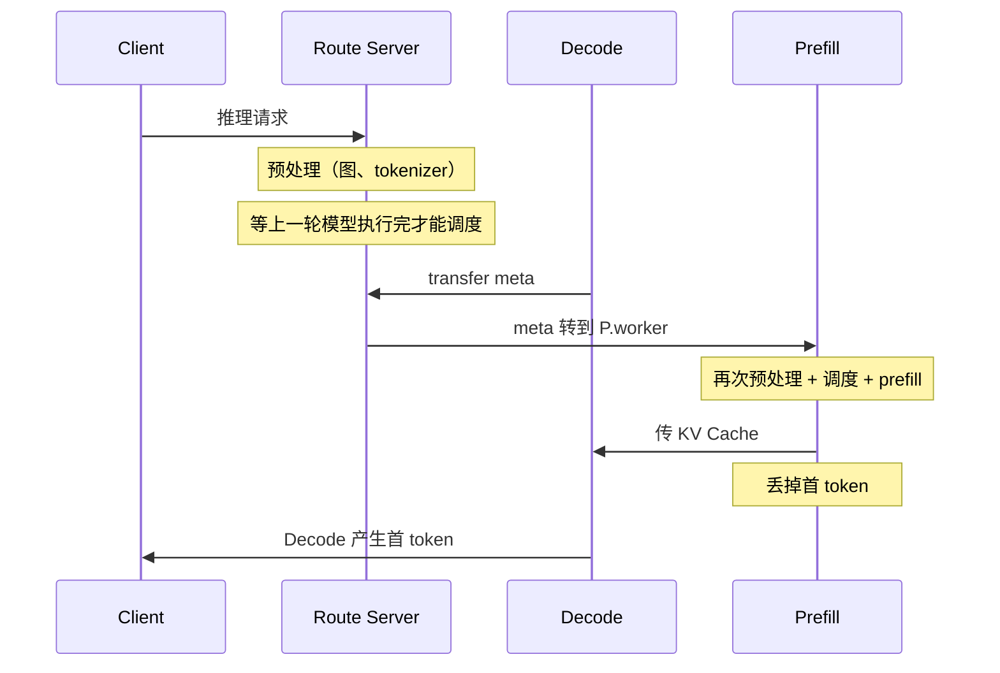
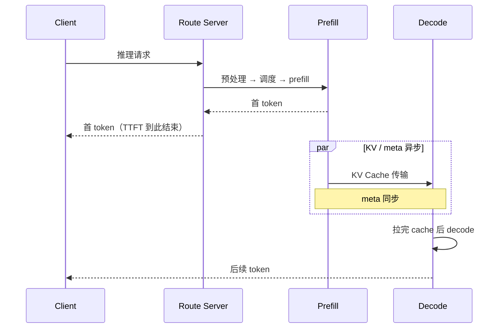

# 分层传输先 P 后 D（Layerwise-CPCD）

- 链路：RouteServer ↔ Prefill ↔ Decode 的调度顺序、meta 握手、首 token 回包
- 收益：单并发 TTFT ↓ 70ms+；适配后 PD 配比调整 + P 执行与等 D 地址异步化，纯文本再降 20ms+
- 配置：`VLLM_ASCEND_ENABLE_TRANSFER_MM_FEATURES=1`；RS `--infer-mode Layerwise-CPCD`

社区原方案是 **先 D 后 P**：先把 Decode 收端 meta 备好，Prefill 才跑；**回给客户端的首 token 来自 Decode**。优化后拆成两条并行路径：首 token 只走 Prefill，KV/meta 异步交给 Decode。

## 问题怎么识别

对照社区时序，TTFT 关键路径上有四段不该在「出第一个 token」里的工作：

| 社区步骤 | 识别出的问题 |
|---------|-------------|
| 预处理 + 调度必须等上一轮请求的模型执行完成 | 调度串行，上一请求还在跑，下一请求进不了调度 |
| 先发 transfer meta：`D.scheduler → RS → P.worker` | Prefill 启动被 D 侧地址/meta 堵住 |
| P 侧再做一遍预处理，再调度，再 prefill | 预处理做了两次 |
| P 把 KV 传给 D，**丢掉 P 算出的首 token**；Decode 再产首 token 回客户端 | TTFT 包含一次 Decode；P 的首 token 白算 |

所以瓶颈不是 KV 带宽，是 **首 token 被绑在 Decode 启动之后**。多模态还要加图预处理，先 D 后 P 会把「等 D + 双份预处理 + 丢首 token」和更重的 P 焊死，后面没法继续叠优化。

## 社区方案：先 D 后 P

```text
1. 推理请求 → Route Server

2. 推理请求预处理（图片预处理、tokenizer 等）
   请求调度
   ※ 必须等待上一轮请求的模型执行完成，才能进入本轮调度

3. 发送 transfer meta
   D.scheduler → RS → P.worker
   （Decode 收端信息先到位，Prefill 才能继续）

4. P 侧再次推理请求预处理
   请求调度
   执行 prefill

5. P 向 D 传输 KV Cache
   丢掉 P 侧首 token

6. 执行 Decode，产生首 token，返回客户端
```



TTFT 实际串了：等上一轮 → 预处理① → D meta → 预处理② → prefill → KV 传输 → decode 出 token。

## 优化方案：先 P 后 D

首 token 和 KV/Decode **拆开**。客户端看到的 TTFT 只走上面这条；Decode 只负责后续 token。

### 首 token 生成（TTFT 路径，不经过 Decode）

```text
1. 推理请求 → Route Server
2. 请求预处理 → 请求调度 → 执行 prefill
3. prefill 完成，返回首 token
   Prefill 模块 API Server → Route Server
4. Route Server → 客户端
```

### KV Cache 传输和 Decode（与首 token 异步）

```text
1. 推理请求 → Route Server
2. 请求预处理 → 请求调度 → 执行 prefill
3. prefill 完成，返回首 token（同时进入下面，不阻塞回包）
4. KV Cache 传输 与 meta 信息同步 异步执行
5. D 侧拉取完 cache，开始 decode（后续 token）
```



和原文 Layerwise-CPCD 的衔接：RS 仍可在 P 预处理完成后经 `/v1/metaserver` 带 `kv_transfer_params` 去调度 D；P 在等 D 地址期间继续异步推理。关键语义是 **等 D 不再挡首 token 回包**，meta/KV 与回包重叠。

## 改前改后差在哪

| | 先 D 后 P（社区） | 先 P 后 D（本方案） |
|--|------------------|-------------------|
| 调度何时能进 | 等上一轮模型执行完 | 预处理完即可进 P 调度 |
| 谁先握手 | D 先发 transfer meta 到 P | P 先跑；meta/KV 异步 |
| 预处理次数 | RS 一次 + P 再一次 | 一次（随 P 执行） |
| 首 token 从哪来 | Decode 现算；P 的丢掉 | Prefill 直接回 RS→客户端 |
| TTFT 是否含 Decode | 含：传完 KV 再 decode 出第一个 | 不含：D 只接后续 token |
| 等 KV 地址 | 在 P 启动前，全同步 | 不挡首 token；与传输异步 |

现场还改了 PD 配比，并把「prefill 执行」与「等待 decode kvcache 地址」彻底异步，给多模态留出 P 侧先跑图处理和 ViT 的空间。

## 学习要点

- 识别时把 **首 token 回包路径** 和 **KV 传输路径** 画成两张图。社区方案把它们焊成一条，还会丢掉 P 的首 token。
- 实现改动是调度顺序 + 回包归属：RS 模式 `Layerwise-CPCD`，P 的 API Server 负责首 token，D 只在拉完 cache 后接 decode。
- 和 [12](12-kv-batch-sync.md) 正交：本条改「谁先跑、首 token 从谁出」；那条改每层 `Event::sync` 粒度。
