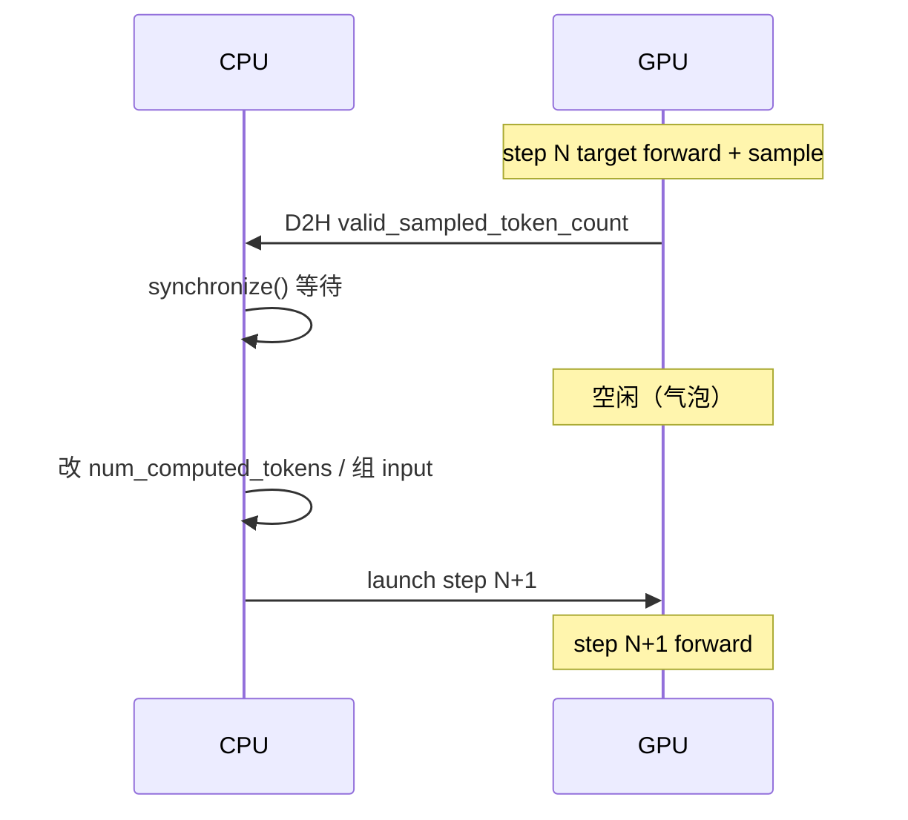
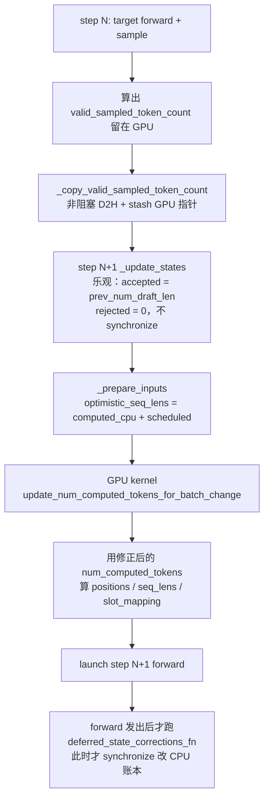
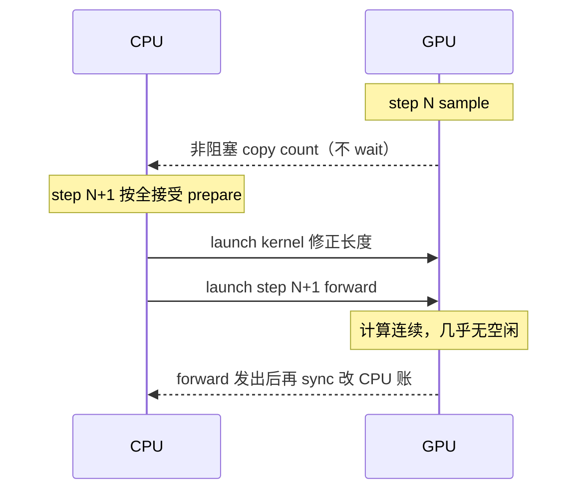
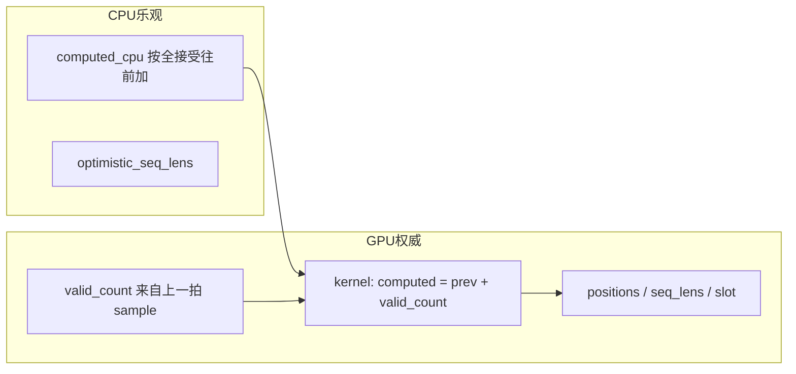

# MTP 零气泡：vLLM 社区怎么实现

材料对的是社区合并稿 [vllm#32951](https://github.com/vllm-project/vllm/pull/32951)（`fafe76b`，从 [#29957](https://github.com/vllm-project/vllm/pull/29957) 重构）。主文件：

- `vllm/v1/worker/gpu_model_runner.py`
- `vllm/v1/spec_decode/utils.py` 里的 `update_num_computed_tokens_for_batch_change`

本项目侧：开关 `ENABLE_ZERO_BUBBLE=1`；昇腾移植 [#7640](https://github.com/vllm-project/vllm-ascend/pull/7640)。收益：同步气泡 5ms+ → ~1ms，TPOT ↓ 1ms+。

---

## 1. 先看开关怎么亮

社区没有 `ENABLE_ZERO_BUBBLE` 这个名字。零气泡 = **async scheduling 开着，并且本步有投机 token**：

```python
# vllm/v1/worker/gpu_model_runner.py
self.use_async_spec_decode = (
    self.use_async_scheduling and self.num_spec_tokens > 0
)
```

用户侧：`--async-scheduling` + `--speculative-config '{"method":"mtp", ...}'`。  
`use_async_spec_decode == False` 时走老路：`_get_valid_sampled_token_count()` 里 `event.synchronize()`，每 step 等 D2H。

---

## 2. 气泡从哪来（改前）

投机解码一步要做两件事：target 验 draft（rejection sample），再按 **真正接受了几个** 改 `num_computed_tokens`，才能组下一拍的 positions / slot mapping / input_ids。

老路径把「接受个数」当成 CPU 权威：

```text
sample 在 GPU 上算出 accepted
    → D2H + Event.synchronize()     ← 这里出气泡
    → CPU 改 num_computed_tokens
    → 再 H2D、prepare、launch 下一拍
```

对应代码就是 `_get_valid_sampled_token_count()`：先等 copy stream 上的 event，再读 pinned CPU tensor。

```python
def _get_valid_sampled_token_count(self) -> list[int]:
    sampled_count_event = self.valid_sampled_token_count_event
    ...
    sampled_count_event.synchronize()   # 阻塞，等 GPU→CPU
    return counts_cpu[: prev_sampled_token_ids.shape[0]].tolist()
```

async + spec 时，本拍 CPU 准备（`_update_states` + `_prepare_inputs` + 图 launch）只能和 **上一拍 draft 的 GPU** 重叠。draft 比这段 CPU 短，中间就空一截。XHS 场景 profiling 是 **每 Decode step 5ms+**。



---

## 3. 改后总流程：乐观假设 + 异步 + 设备端修正

核心：CPU 先当「上一轮 draft 全接受」，**立刻**组下一拍并 launch；真正接受个数留在 GPU 上的 `valid_sampled_token_count_gpu`，在 `_prepare_inputs` 里用 kernel 改 `num_computed_tokens` / `num_accepted_tokens` / positions / seq_lens。CPU 记账推迟到 **本拍 forward 已经发出之后**。



和改前比，**launch 不再等 synchronize**。GPU 权威，CPU 乐观。



---

## 4. 逐步对代码

下面都来自 `#32951` 的 `gpu_model_runner.py` / `spec_decode/utils.py`。

### 4.1 step N：把接受个数留在 GPU，不堵下一拍

sample 之后，drafter 在 GPU 上算出 `valid_sampled_tokens_count`（`1 + 真正接受的 draft 数`）。`_copy_valid_sampled_token_count` 做两件事：

1. 另开 copy stream，**non_blocking** 抄到 CPU（给以后记账用）
2. 零气泡模式下把 **GPU tensor 指针 stash 住**，下一拍 `_prepare_inputs` 直接用

```python
def _copy_valid_sampled_token_count(
    self, next_token_ids: torch.Tensor, valid_sampled_tokens_count: torch.Tensor
) -> None:
    with torch.cuda.stream(self.valid_sampled_token_count_copy_stream):
        self.valid_sampled_token_count_copy_stream.wait_stream(default_stream)
        counts_cpu[: counts.shape[0]].copy_(counts, non_blocking=True)
        self.valid_sampled_token_count_event.record()

    if self.use_async_spec_decode:
        # 下一拍 GPU 修正用，不经过 CPU
        self.valid_sampled_token_count_gpu = valid_sampled_tokens_count
```

这里 **没有 synchronize**。

### 4.2 step N+1 `_update_states`：CPU 当全接受

scheduler 送来的 `num_computed_tokens` 已经按「上一拍 scheduled 的 draft 全进了」往前加。零气泡路径不再立刻 `_get_valid_sampled_token_count()`，而是：

```python
# 乐观：上一拍 draft 全接受
optimistic_num_accepted = req_state.prev_num_draft_len
req_state.output_token_ids.extend([-1] * optimistic_num_accepted)

deferred_spec_decode_corrections.append(
    (req_id, optimistic_num_accepted, req_state)
)
self.prev_num_draft_tokens.np[prev_req_index] = optimistic_num_accepted
```

注释写得很直：*Optimistically assume all accepted; queue up a correction to be called after the model forward... Corrected on GPU in `_prepare_inputs`.*

`prev_num_draft_len` 的步进（注释里的例子）：

```text
step1: computed=0,           spec=[],    prev_draft=0
step2: computed=prompt_len,  spec=[a,b], prev_draft=0
step3: computed=prompt_len+2, spec=[c,d], prev_draft=2
        ↑ 从这一拍起，CPU 账里已经含上一拍的 spec 长度
```

`_update_states` 返回一个 **闭包** `correct_spec_decode_token_counts`，先不跑。真正 sync、按拒绝个数往回减，要等本拍 forward launch 之后（见 4.5）。

### 4.3 `_prepare_inputs`：先算乐观 seq_lens

```python
# 假定上一拍 draft 全接受
torch.add(
    self.input_batch.num_computed_tokens_cpu_tensor[:num_reqs],
    torch.from_numpy(num_scheduled_tokens),
    out=self.optimistic_seq_lens_cpu[:num_reqs],
)
```

`optimistic_seq_lens = computed_cpu + scheduled`。attention metadata 的 `max_seq_len`、discard mask 先用这个乐观值，避免等 GPU。

同时建 `prev_positions`：当前 batch 第 i 行 ↔ 上一拍第几行（新请求是 -1）。后面 kernel 用它去 gather 上一拍的 `valid_sampled_token_count_gpu`。

### 4.4 设备端修正（这条是零气泡的心脏）

```python
if (
    self.use_async_spec_decode
    and self.valid_sampled_token_count_gpu is not None
    and prev_req_id_to_index
):
    update_num_computed_tokens_for_batch_change(
        self.num_computed_tokens,              # 本拍 GPU 上的 computed
        self.num_accepted_tokens.gpu[:num_reqs],
        self.prev_positions.gpu[:num_reqs],    # 当前行 → 上一拍行
        self.valid_sampled_token_count_gpu,    # 上一拍真实 valid_count
        self.prev_num_draft_tokens.gpu,        # 上一拍乐观 draft 数
        cpu_values,                            # 乐观 CPU computed
    )
```

kernel 全文（`vllm/v1/spec_decode/utils.py`）：

```python
@torch.compile(dynamic=True, backend=current_platform.simple_compile_backend)
def update_num_computed_tokens_for_batch_change(
    num_computed_tokens,
    num_accepted_tokens,
    prev_positions,
    valid_sampled_token_count,
    prev_num_draft_tokens,
    cpu_num_computed_tokens,
) -> None:
    gather_indices = prev_positions.clamp(min=0)

    valid_counts = valid_sampled_token_count[gather_indices]
    prev_computed = num_computed_tokens[gather_indices]
    prev_drafts = prev_num_draft_tokens[gather_indices]

    participating = (prev_positions >= 0) & (prev_drafts > 0)
    corrected = prev_computed + valid_counts.int()

    num_computed_tokens[:n].copy_(
        torch.where(participating, corrected, cpu_num_computed_tokens)
    )
    num_accepted_tokens.copy_(
        torch.where(participating, valid_counts, num_accepted_tokens)
    )
```

用数字走一遍。上一拍 draft 2 个，target 只接受 1 个（再加 bonus token，`valid_count = 2`）：

```text
valid_count     = 1 + accepted_drafts = 2
CPU 乐观 computed 已经 +3（2 draft + 1 bonus）
kernel:
  participating = True
  num_computed  = prev_gpu_computed + 2     # 只加真正有效的
  rejected      = prev_drafts + 1 - valid_count
                = 2 + 1 - 2 = 1             # 拒掉 1 个
新请求 / prefill（prev_positions < 0 或 prev_drafts == 0）:
  直接用 cpu_num_computed_tokens，不改
```

修正完立刻在 GPU 上重算，不再等 CPU：

```python
self.positions[...] = num_computed_tokens[req_indices] + query_pos
self.seq_lens[:num_reqs] = num_computed_tokens + num_scheduled_tokens
self.input_batch.block_table.compute_slot_mapping(...)  # 也在 GPU
```

M-RoPE / XD-RoPE 再补一刀 drift：`gpu_computed - cpu_optimistic`，把位置编码扳回来。



### 4.5 forward 发出之后，才改 CPU 账本

`execute_model` 里：

```python
deferred_state_corrections_fn = self._update_states(scheduler_output)
# ... _prepare_inputs（GPU 已修正）...
# ... launch target forward ...

# Now the batch has been launched we can wait for corrections
# from the previous model forward without breaking async scheduling.
if deferred_state_corrections_fn:
    deferred_state_corrections_fn()
```

闭包这时才 `synchronize()`，按真实接受个数把 CPU 上多加的减回去：

```python
def correct_spec_decode_token_counts():
    valid_sampled_token_count = self._get_valid_sampled_token_count()  # 这里才 sync
    ...
    num_accepted = valid_sampled_token_count[prev_req_index] - 1
    correction = optimistic_num_accepted - num_accepted
    req_state.num_computed_tokens -= correction
    self.input_batch.num_computed_tokens_cpu[cur_req_index] -= correction
```

sync 和 GPU 计算重叠，不再挡 launch。例外：`mamba_cache_mode == "align"` 时，`preprocess_mamba` 必须读 CPU 上的 `num_computed_tokens`，会在 preprocess **之前**先跑这个闭包（会牺牲一点零气泡，换对齐正确）。

Hybrid（Qwen3.5 GDN）在 sample 之后还有 `_update_states_after_model_execute`：在 GPU 上从 `sampled_token_ids` 里找第一个 `-1`，得到 `num_accepted_tokens`，下一拍用来挪线性注意力状态。`#32951` 里对 align 模式仍有一处 `.cpu()`，注释写着 *TODO: Remove .cpu() sync to enable fully async for hybrid*。后面社区又用 `#38556` / `#45100` 修 async 下行重排把接受个数抄错的问题。

---

## 5. 和本项目 / 昇腾的对应

| | 社区 vLLM | 本项目 / vllm-ascend |
|--|-----------|----------------------|
| 开关 | `--async-scheduling` + spec | `ENABLE_ZERO_BUBBLE=1`（外加适配） |
| 修正 kernel | `update_num_computed_tokens_for_batch_change` | 同名，在 `vllm_ascend/spec_decode/utils.py` |
| seq_lens | 以 GPU tensor 为权威 | 昇腾 page attention 要 CPU `seq_lens`，所以多了 `optimistic_seq_lens_cpu` 的非阻塞回抄，或 `correct_optimistic_seq_lens_cpu`（同一套 `rejected = prev_drafts+1-valid_count`） |
| 0.19.rc1 | 已合入 | `platform.py` 曾因缺设备侧修正而关掉 async+spec，要 `#7640` + `#8461` 才真正亮 |

---

## 6. 一句话串起来

```text
CPU 不再问「上一拍接受了几个」才敢 launch。
它先当全接受把下一步发到 GPU；
GPU 用上一拍留下的 valid_count 把 computed/positions/slot 改对；
CPU 账本等 forward 已经在飞再 synchronize 减回去。
```

这就是「所有修正在设备端完成，不把计数拉回 CPU 再开下一轮」。
