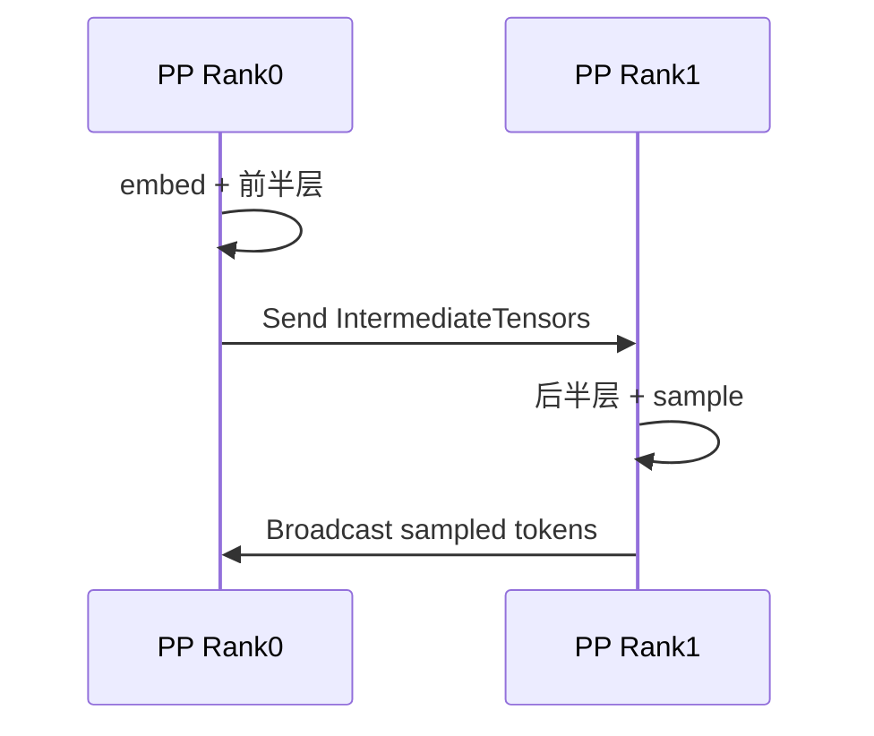
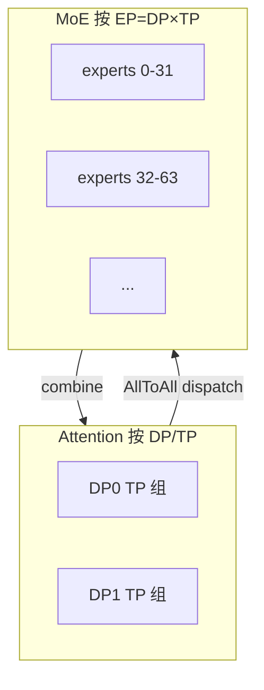

# 切分策略

六种策略切的不是同一个东西。先看「切什么」，再看通信，最后才记启动参数。

```text
一次前向里能被切开的东西

  请求 / batch  ──────────────  DP
  Transformer 层 ────────────  PP
  同一层里的矩阵 / 头 ────────  TP
  MoE 的专家权重 ────────────  EP
  激活的 token / 序列维 ──────  SP（推理里多半是 TP 的通信改写）
  KV / 上下文的序列维 ────────  CP（Prefill CP / Decode CP）
```

## 张量并行 TP

**切什么：** 同一层的权重矩阵。每张卡都跑全部层，但只持有矩阵的一列块或一行块。

原理是把 `Y = X @ W` 拆开算。约定：X 是 `[token, in]`，W 是 `[in, out]`，Y 是 `[token, out]`。TP=2。

**列拆分**（`ColumnParallelLinear`）：W 按**输出维**竖着切成左右两块。

```text
W = [ W0 | W1 ]          每卡一块列，形状 [in, out/2]

Y  = X @ [ W0 | W1 ]
   = [ X@W0 | X@W1 ]     每卡用完整 X，算出 Y 的一半

Rank0 持有 W0，得到 Y 的左半；Rank1 持有 W1，得到 Y 的右半。
输入 X 每张卡都有一份；算完默认不通信。要完整 Y 时再 AllGather。
```

**行拆分**（`RowParallelLinear`）：W 按**输入维**横着切成上下两块，X 也按最后一维切开。

```text
W = [ W0 ]               每卡一块行，形状 [in/2, out]
    [ W1 ]

X = [ X0 | X1 ]

Y  = X0@W0  +  X1@W1     每卡算一份「部分和」，形状都是完整的 [token, out]

Rank0：X0 @ W0
Rank1：X1 @ W1
AllReduce 把两份加起来，每张卡都得到完整 Y。
```

列拆分切的是**输出**，行拆分切的是**输入**。MLP 因此固定成一对：先 Column（gate/up），中间 SiLU 各算各的，再 Row（down）用 AllReduce 拼回去。

```text
MLP 一层（TP=2）

          Rank0                    Rank1
     ┌─────────────┐          ┌─────────────┐
X ──►│ W_up[:, 左] │     X ──►│ W_up[:, 右] │     Column：输入完整，输出切开
     └──────┬──────┘          └──────┬──────┘
            │ SiLU                   │ SiLU          逐元素，不用通信
            ▼                        ▼
     ┌─────────────┐          ┌─────────────┐
     │ W_dn[上, :] │          │ W_dn[下, :] │     Row：输入切开，部分和
     └──────┬──────┘          └──────┬──────┘
            └──────── AllReduce ──────┘
                       ▼
                    完整 Y
```

Attention 同构：`QKVParallelLinear` 按头切（GQA 时 KV 头不够会在 TP 组内复制），本地做 attention，`o_proj` 用 `RowParallelLinear` 再 AllReduce。


**通信：** 几乎每层一次 AllReduce（decode 时 token 少，AllReduce 延迟很容易成为 TPOT 瓶颈）。Embedding / LM Head 走 `VocabParallelEmbedding`，词表按行切，前后常配 AllReduce 或 AllGather。

**效果：**

- 单卡装不下权重时的第一刀。单机多卡、有 NVLink，优先 TP。
- TP 越大，每卡算力越碎，通信次数不减。GQA / MLA 的 KV 头很少，TP 超过头数后 KV 会在多卡上复制，显存白花。
- 官方经验：先加到「KV cache 行数 / 并发」够用；跨节点再叠 PP，而不是无脑把 TP 拉到集群总卡数。

## 流水并行 PP

**切什么：** 层。Rank 0 拿 embedding + 前几层，中间 Rank 拿中间层，最后 Rank 拿剩下的层 + norm + LM Head。

```text
PP=2，模型 48 层

Rank0 / Stage0                    Rank1 / Stage1
embed + layers[0:24]              layers[24:48] + norm + lm_head
        │ Send hidden, residual
        └────────────────────────►│ Recv 后接着算
                                  │ 采样出 token
        │ Broadcast sampled ids   │
        ◄─────────────────────────┘
```



**通信：** 阶段之间是点对点 Send / Recv，不是 AllReduce。体积是一份 hidden（加 residual），比 TP 每层 AllReduce 轻，所以没 NVLink、跨节点时 PP 往往比纯 TP 更划算。最后一阶段要把采样 token 广播回前面各 stage，下一轮才能继续。

**效果：**

- 单机卡数除不尽、或卡之间没有 NVLink（例如 L40S）：官方建议 `TP=1, PP=卡数`。
- 跨节点经典配方：`TP = 每节点卡数`，`PP = 节点数`。
- Decode 每步只有 1 个 token，流水线很难填满，气泡明显。推理里 PP 主要换的是「装得下」，不是 decode 延迟。Prefill 大 batch 时微批可以掩盖一部分气泡。

## 数据并行 DP

**切什么：** 请求。每张卡（或每个 TP 组）持有同一份 Attention 权重，独立 KV cache，各自跑自己的 batch。

```text
DP=2 TP=2，共 4 卡

        DP rank0                    DP rank1
     TP0        TP1              TP0        TP1
   replica A  replica A        replica B  replica B
   请求 1,3   同左切权重         请求 2,4   同左切权重
   独立 KV                      独立 KV
```

稠密模型：DP rank 之间前向互不通信，入口把请求分出去就行。

MoE 模型：专家层要在 `DP × TP` 范围内同步。任一 rank 还有请求在跑，空闲 rank 必须跟一次 dummy forward，否则 AllToAll / AllGather 对不齐。vLLM 用独立的 DP Coordinator 做这件事。

**通信：** 稠密几乎为零。MoE 时专家层走 EP 或「把 MoE 当成更大的 TP」。调度侧用 ZMQ，不算 NCCL 集合通信。

**效果：**

- 吞吐按 rank 数近似线性扩，前提是负载均衡和 prefix cache 命中。每个 DP rank 一份独立 KV，相同前缀打到同一 rank 才能吃到 APC。
- `--max-num-seqs` 是 **每个 DP rank** 的上限；`--max-num-queued-reqs` 是整机。DP=4 时如果队列上限仍按单 rank 来设，会提前拒请求。
- 不增加单请求算力，不降低 TTFT。单条长请求仍然要靠 TP / CP。

## 专家并行 EP

**切什么：** MoE 的专家权重。Attention 仍按 DP/TP；专家按卡切开，每张卡只留一部分 expert。

vLLM 里 EP 大小不是单独的启动参数，而是算出来的：

```text
EP_SIZE = TP_SIZE × DP_SIZE
```

`--enable-expert-parallel` 打开后，专家层从「当成 TP 切矩阵」改成「按 expert 切卡」。

```text
TP=2 DP=4，共 8 卡，EP=8

Attention：4 个 DP 组，每组内 TP=2 切 QKV/O
Experts：8 张卡分 256 个 expert，每卡 32 个（无冗余时）

Token 路由：
  本卡 hidden + topk_ids
       │ AllToAll dispatch（按 expert 归属换卡）
       ▼
  持有该 expert 的卡做 GEMM
       │ AllToAll / ReduceScatter combine
       ▼
  token 回到原卡，和 Attention 输出对齐
```



不开 EP 时，MoE 层会组成大小为 `TP × DP` 的 TP 组，和稠密模型一样切矩阵。对 DeepSeek 这类 MLA + 海量 expert 的模型，EP 局部性更好。

**通信：** `--all2all-backend` 决定具体原语：

| backend | 实际集合通信 | 更适合 |
|---------|----------------|--------|
| `allgather_reducescatter`（默认） | AllGather 收 token，ReduceScatter 送回 | 通吃 |
| `deepep_high_throughput` | DeepEP 高吞吐 AllToAll | Prefill / PD 的 P |
| `deepep_low_latency` | DeepEP 低延迟 AllToAll | Decode / PD 的 D |

Token 按 expert 分布不均时开 `--enable-eplb`，周期性把热 expert 迁到别的卡（可加冗余 expert）。这是权重搬迁，不是前向主路径。

**效果：**

- 专家权重按卡切开，单卡显存下降，才能把 Attention 做成 DP 复制、把 KV 做大。
- 代价是每层 MoE 一次 dispatch + combine。Prefill token 多，用高吞吐 backend；Decode token 少，用低延迟 backend。PD 分离时 P/D 可以选不同 backend。
- `--enable-dbo` 把 AllToAll 和计算重叠，是 EP 上常用的下一刀。

## 序列并行 SP

**切什么：** 激活的 token 维，不是再切一份权重。推理里它多半是 **TP 通信的改写**，让 LayerNorm 只看到 `1/TP` 的 token，并为后面的 AsyncTP（GEMM 和通信重叠）铺路。

训练 Megatron-SP 是「LayerNorm / Dropout 沿序列切开，省激活显存」。vLLM 的编译期 SP 做的是图替换：

```text
原来（TP）：
  RowParallelLinear ── AllReduce ── RMSNorm ── 下一层

改写后（SP）：
  RowParallelLinear ── ReduceScatter ── 本地 RMSNorm ── AllGather ── 下一层
                       （每卡 1/TP token）
```

ReduceScatter + AllGather 的总字节数等于一次 AllReduce，但 RMSNorm 算在切开的序列上，而且这两段通信可以分别和前后 GEMM 融合（`fuse_gemm_comms` / AsyncTP）。

还有一条 MoE 相关的 SP：`ParallelConfig.use_sequence_parallel_moe`。TP>1 且 DP>1 且开了 EP 时，Attention 的 `o_proj` AllReduce 会让进入专家层的 token 在 TP 组内重复。把专家输入改成 sequence parallel，避免同一 token 被算多遍、AllToAll 再传多遍。

**通信：** ReduceScatter、AllGather，走 TP group。

**效果：**

- 本身不保证更快，是 AsyncTP 的前置。小 batch 时切开再聚合的开销可能更亏。
- vLLM 默认只在大 hidden（H100/Blackwell 上 `hidden_size >= 8192`）且 token 数过阈值时启用。可在 `compilation_config` 里设 `enable_sp`、`sp_min_token_num`。
- 看 profile：AllReduce 很胖、RMSNorm 跟在后面，才值得开。

## 上下文并行 CP

**切什么：** KV / 上下文的 **序列维**。TP 切的是头（H），CP 切的是时间（T）。

vLLM 把 Prefill 和 Decode 拆开，因为 SLO 完全不同：

| | Prefill CP（PCP） | Decode CP（DCP） |
|--|-------------------|------------------|
| 要解决的 | 长 prompt 的 TTFT | 长上下文 decode 的 KV 显存 |
| 切法 | 新 token 切成 N 段，每卡算一段 QKV | KV cache 沿 T 交错切到 TP 组内各卡 |
| 卡数 | `world_size` **乘上** `prefill_context_parallel_size` | **不增卡**，复用 TP 的 GPU |
| 启动 | `--prefill-context-parallel-size` | `--decode-context-parallel-size` / `-dcp` |

Decode 侧为什么需要 DCP：

```text
KV 总量 ≈ H_kv × T

1. 单卡放得下 → 不切
2. 不够 → 先 TP，沿 H 切（`-tp`）
3. TP 超过 H_kv 之后，多出来的卡只能复制 KV
   复制倍数 = tp_size / H_kv
4. 再开 DCP，沿 T 切掉复制
   dcp 范围 [1, tp_size / H_kv]，且 tp 必须能被 dcp 整除
```

交错存储（interleave），后续新 token 自然落到下一张卡，不用重排：

```text
DCP=2，token 下标 0,1,2,3,4,...

Rank0 KV:  0  2  4  6  8
Rank1 KV:  1  3  5  7
```

一步 decode：

```text
各卡算出自己那片 Q
    │ AllGather Q          ← decode 只有 1 个 token，这份通信很便宜
    ▼
各卡用完整 Q × 本地 KV 做 attention
    │ ReduceScatter / AllToAll 合并 output
    ▼
完整 hidden，继续 MLP
```

MLA（DeepSeek）有效 KV 头 = 1，`-tp 8` 就是 8 份 KV 复制，`-dcp 8` 一次切掉。GQA 如 Qwen3-235B 有 4 个 KV 头，`-tp 8` 只复制 2 倍，`-dcp 2` 即可。

Prefill CP 两条路（上游仍在推进）：

1. 部分 Q、完整 KV：AllGather 各卡的 K/V，每卡只算自己那一段 Q。加速 TTFT，显存仍要扛完整 KV。
2. 部分 Q、部分 KV：ring attention，K/V 一块块 Send/Recv 转圈。上下文极长、完整 KV 放不下时才走。

**效果：**

- DCP 换的是 KV 容量和 decode batch，不是单 token 算力。通信随 dcp 变大而增加，所以先把 TP 加到性能够用，再加 DCP 去复制。
- DCP 不增加 `world_size`，和「再加一组 GPU」不是一回事。
- PCP 尚未完全落地；昇腾侧明确 PCP 保持 1。PD 传 KV 时要把 `--cp-kv-cache-interleave-size` 设成 block size，否则 block 对不齐。

## 怎么叠

六种可以同时开，但职责正交：

```text
请求先按 DP 分到副本
  每个副本内部：
    层按 PP 切开
      每一层内部：
        Attention 权重按 TP 切（或 DP 复制）
        KV 序列维按 DCP 切
        MoE 专家按 EP 切（EP = TP × DP）
        激活 token 维可按 SP 改写 AllReduce
```

常见配方：

| 场景 | 配方 |
|------|------|
| 单机稠密 70B | `TP=8` |
| 两机 405B，每机 8 卡 | `TP=8 PP=2` |
| 单机 DeepSeek-V3，H200×8 | `TP=1 DP=8 --enable-expert-parallel` |
| 同上但要去 KV 复制 | 再加 `-dcp`（MLA 可到 8） |
| Prefill / Decode 角色分离 | P、D 各自一套 TP/DP/EP；KV 走 Connector，不是这六种之一 |
