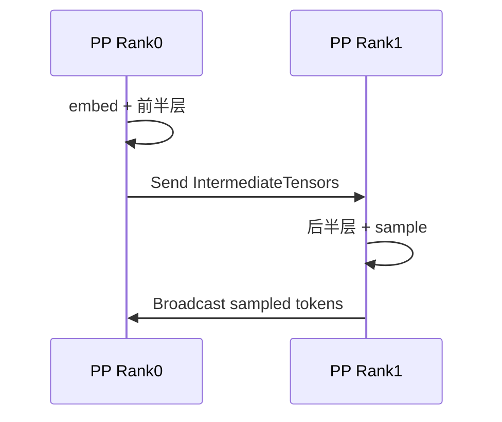
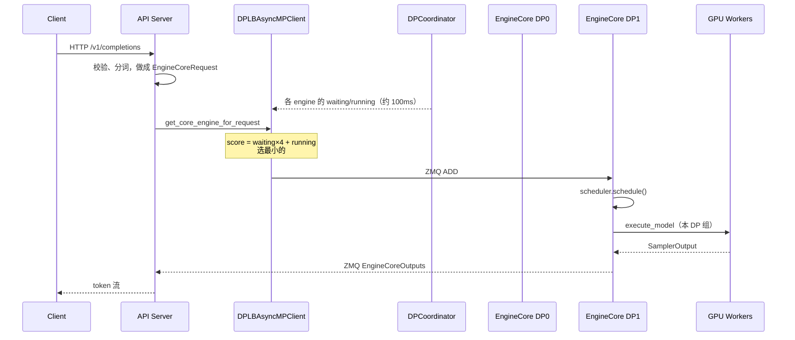
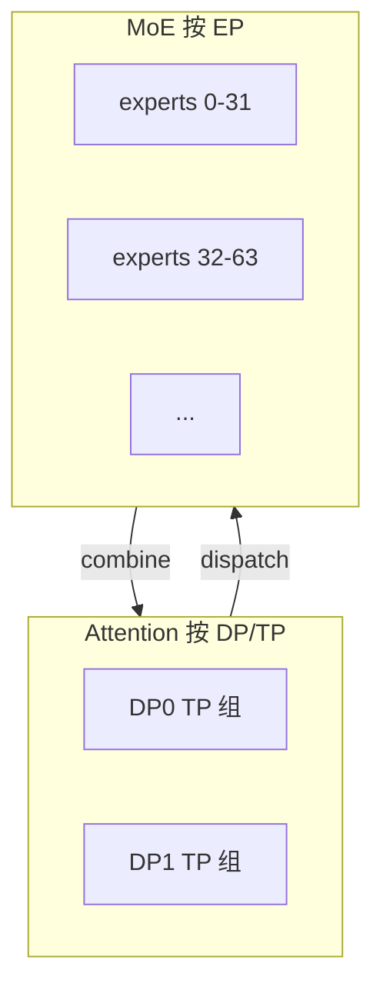
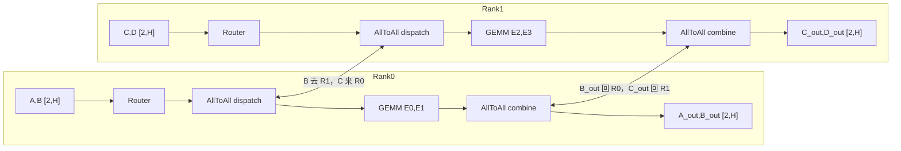
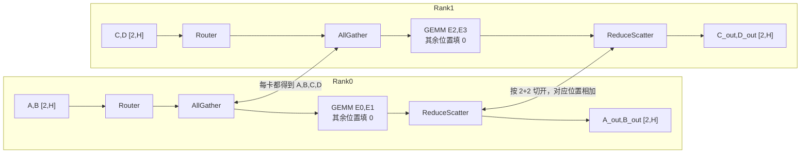
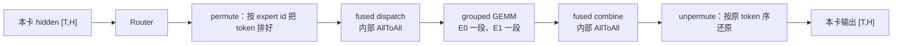

# 切分策略

六种策略切的不是同一个东西。先看「切什么」，再看通信，最后才记启动参数。

```text
一次前向里能被切开的东西

  请求 / batch  ──────────────  DP
  Transformer 层 ────────────  PP
  同一层里的矩阵 / 头 ────────  TP
  MoE 的专家权重 ────────────  EP
  激活的 token / 序列维 ──────  SP（推理里多半是 TP 的通信改写）
  KV / 上下文的序列维 ────────  CP（Prefill CP / Decode CP）
```

## 张量并行 TP

**切什么：** 同一层的权重矩阵。每张卡都跑全部层，但只持有矩阵的一列块或一行块。

原理是把 `Y = X @ W` 拆开算。约定：X 是 `[token, in]`，W 是 `[in, out]`，Y 是 `[token, out]`。TP=2。

**列拆分**（`ColumnParallelLinear`）：W 按**输出维**竖着切成左右两块。

```text
W = [ W0 | W1 ]          每卡一块列，形状 [in, out/2]

Y  = X @ [ W0 | W1 ]
   = [ X@W0 | X@W1 ]     每卡用完整 X，算出 Y 的一半

Rank0 持有 W0，得到 Y 的左半；Rank1 持有 W1，得到 Y 的右半。
输入 X 每张卡都有一份；算完默认不通信。要完整 Y 时再 AllGather。
```

**行拆分**（`RowParallelLinear`）：W 按**输入维**横着切成上下两块，X 也按最后一维切开。

```text
W = [ W0 ]               每卡一块行，形状 [in/2, out]
    [ W1 ]

X = [ X0 | X1 ]

Y  = X0@W0  +  X1@W1     每卡算一份「部分和」，形状都是完整的 [token, out]

Rank0：X0 @ W0
Rank1：X1 @ W1
AllReduce 把两份加起来，每张卡都得到完整 Y。
```

列拆分切的是**输出**，行拆分切的是**输入**。MLP 因此固定成一对：先 Column（gate/up），中间 SiLU 各算各的，再 Row（down）用 AllReduce 拼回去。

```text
MLP 一层（TP=2）

          Rank0                    Rank1
     ┌─────────────┐          ┌─────────────┐
X ──►│ W_up[:, 左] │     X ──►│ W_up[:, 右] │     Column：输入完整，输出切开
     └──────┬──────┘          └──────┬──────┘
            │ SiLU                   │ SiLU          逐元素，不用通信
            ▼                        ▼
     ┌─────────────┐          ┌─────────────┐
     │ W_dn[上, :] │          │ W_dn[下, :] │     Row：输入切开，部分和
     └──────┬──────┘          └──────┬──────┘
            └──────── AllReduce ──────┘
                       ▼
                    完整 Y
```

Attention 同构：`QKVParallelLinear` 按头切（GQA 时 KV 头不够会在 TP 组内复制），本地做 attention，`o_proj` 用 `RowParallelLinear` 再 AllReduce。


**通信：** 几乎每层一次 AllReduce（decode 时 token 少，AllReduce 延迟很容易成为 TPOT 瓶颈）。Embedding / LM Head 走 `VocabParallelEmbedding`，词表按行切，前后常配 AllReduce 或 AllGather。

**效果：**

- 单卡装不下权重时的第一刀。单机多卡、有 NVLink，优先 TP。
- TP 越大，每卡算力越碎，通信次数不减。GQA / MLA 的 KV 头很少，TP 超过头数后 KV 会在多卡上复制，显存白花。
- 官方经验：先加到「KV cache 行数 / 并发」够用。量化后仍单机装不下、或没 NVLink 时才叠 PP，不要无脑把 TP 拉到集群总卡数。

## 流水并行 PP

**切什么：** 层。Rank 0 拿 embedding + 前几层，中间 Rank 拿中间层，最后 Rank 拿剩下的层 + norm + LM Head。

```text
PP=2，模型 48 层

Rank0 / Stage0                    Rank1 / Stage1
embed + layers[0:24]              layers[24:48] + norm + lm_head
        │ Send hidden, residual
        └────────────────────────►│ Recv 后接着算
                                  │ 采样出 token
        │ Broadcast sampled ids   │
        ◄─────────────────────────┘
```



**通信：** 阶段之间是点对点 Send / Recv，不是 AllReduce。体积是一份 hidden（加 residual），比 TP 每层 AllReduce 轻，所以没 NVLink、跨节点时 PP 往往比纯 TP 更划算。最后一阶段要把采样 token 广播回前面各 stage，下一轮才能继续。

**效果：** 对通信要求低（相对 TP），换到的是「层能拆到多卡上装得下」。

**空泡：** batch 小的时候很明显。流水线要前面 stage 算完才能 Send，后面 stage 只能等。Decode 每步 1 个 token，每段算力极薄，微批填不满，气泡接近 `(PP-1)/PP`。Prefill 大 batch 用微批能盖住一部分，decode 盖不住。所以 PP 不降 TPOT，只换显存。

**现在推理为什么基本不用：**

- 权重量化（FP8 / W8A8 / INT4）把权重显存砍到 1/2～1/4
- 卡的 HBM 越来越大（80GB → 140GB+），70B、甚至量化后的更大稠密模型单机 TP 就装得下
- 大 MoE 更走 DP Attention + EP，不靠按层切

所以当前部署默认是 **能量化 + TP/EP 就不要开 PP**。还值得用 PP 的只剩少数情况：没 NVLink 的卡（L40S 一类，官方会建议 `TP=1, PP=卡数`）、量化后仍然单机装不下的超大稠密模型、跨节点还想把 TP 留在节点内。

```text
更常见：量化 + TP（+ MoE 的 EP）   ← 通信是层内 AllReduce / A2A，但没有流水线气泡
更少见：PP 跨层 Send/Recv         ← 通信轻，decode 气泡重
```
## 数据并行 DP

**切什么：** 请求。每张卡（或每个 TP 组）持有同一份权重，Attention 权重和 KV cache 都独立。每个 DP 组服务不同请求，**稠密模型前向互不通信**。

```text
DP=2 TP=2，共 4 卡

        DP rank0                    DP rank1
     GPU0       GPU1             GPU2       GPU3
   同一份权重  TP 切矩阵          再复制一份  TP 切矩阵
   独立 KV                      独立 KV
   请求 1,3                     请求 2,4
```

**效果：** 吞吐按 rank 数近似线性扩。实现是复制引擎 + 把请求分流，模型图不用改。不增加单请求算力，不降低 TTFT。单条长请求仍然要靠 TP / CP。

每个 DP rank 一份独立 KV，相同前缀打到同一 rank 才能吃到 APC。`--max-num-seqs` 是 **每个 DP rank** 的上限；`--max-num-queued-reqs` 是整机（API Server 按全局在途数限流）。

### 进程和 GPU 怎么切

`--data-parallel-size DP --tensor-parallel-size TP` 时：

| 进程 | 数量 | 干什么 |
|------|------|--------|
| API Server | 默认约等于 DP，可用 `--api-server-count` 改 | HTTP、分词、选 rank |
| EngineCore | = DP | 每个 rank 自己的 scheduler + KV |
| GPU Worker | = DP × TP × PP × PCP | 真正占卡、跑 forward |
| DPCoordinator | DP>1 时 1 个（rank0 拉起） | 广播队列长度；MoE 才协调 wave |

GPU 编号在 Worker 里算，不是 NCCL 切出来的：

```text
# vllm/v1/worker/gpu_worker.py  init_device
tp_pp = pipeline_parallel_size * tensor_parallel_size
self.local_rank += data_parallel_rank_local * tp_pp
self.device = cuda:{self.local_rank}

例：DP=2 TP=2
  DP0 的 TP0/TP1 → cuda:0 / cuda:1
  DP1 的 TP0/TP1 → cuda:2 / cuda:3
```

每个 EngineCore 底下的 `MultiprocExecutor.world_size = TP×PP×PCP`，**不含 DP**。所以 DP 组之间根本不在同一个 `init_process_group` 里（稠密路径还会把本进程的 `data_parallel_size` 改回 1）。

### 三种分流模式

| 模式 | 怎么起 | 谁选 rank |
|------|--------|-----------|
| Internal LB（默认） | 一条 `vllm serve --data-parallel-size N` | API Server 里的 `DPLBAsyncMPClient` |
| Hybrid LB | 每节点自己的 API Server + `--data-parallel-hybrid-lb` | 节点内 LB，节点之间靠上游 Ingress |
| External LB | 每个 rank 一次 `vllm serve --data-parallel-rank i --port ...` | 外部路由器；稠密模型甚至可以不起 DP 参数、直接多实例 |

Internal 是「一份 HTTP 入口、多份引擎」。External 是「每份引擎一个端口」。

### 启动：具体方法

入口 `vllm/v1/engine/utils.py` 的 `launch_core_engines`：

```text
1. 读 ParallelConfig
     dp_size              = --data-parallel-size
     local_engine_count   = --data-parallel-size-local（单机默认 = dp_size）
     dp_rank / start_index= --data-parallel-rank / --data-parallel-start-rank

2. DP>1 且在线服务且本进程是 rank0
     → 起 DPCoordinator
     → 填 ZMQ 地址：coordinator_input / coordinator_output / frontend_stats_publish_address

3. 建 handshake ROUTER socket（IPC 或 TCP）

4. CoreEngineProcManager 按 local_engine_count fork 子进程
     每个子进程 target = EngineCoreProc.run_engine_core
     kwargs: dp_rank=global_index, local_dp_rank=local_index

5. wait_for_engine_startup
     每个 EngineCore 连上 handshake，报到 READY
     前端把 input/output ZMQ 地址发回去
     EngineCore 再去连这些 socket，进入 busy loop
```

子进程里的分叉（`vllm/v1/engine/core.py`）：

```python
# EngineCoreProc.run_engine_core
parallel_config.data_parallel_index = dp_rank
if data_parallel and vllm_config.model_config.is_moe:
    parallel_config.data_parallel_rank = dp_rank
    engine_core = DPEngineCoreProc(...)      # 建 DP process group，要对齐
else:
    parallel_config.reconfigure_for_independent_dp_rank()
    engine_core = EngineCoreProc(...)        # 当成 DP=1，完全独立
engine_core.run_busy_loop()
```

稠密走 else：`reconfigure_for_independent_dp_rank()` 把本进程的 `data_parallel_size/rank` 改成 1/0，后面 `init_distributed_environment` 只拉本 TP 组。`data_parallel_index` 仍保留，用来选 GPU、打日志。

MoE 走 `DPEngineCoreProc._init_data_parallel`：

```python
dp_group, dp_store = parallel_config.stateless_init_dp_group(return_store=True)
self.dp_group, self.dp_store = dp_group, dp_store
```

这才有跨 DP rank 的 Gloo/NCCL 组，后面 dummy forward、`sync_dp_state` 用它。

### 一次请求怎么走



选 rank 的具体方法（`DPLBAsyncMPClient.get_core_engine_for_request`）：

```python
if request.data_parallel_rank is not None:
    eng_index = request.data_parallel_rank          # 调用方钉死
else:
    min_score, eng_index = inf, 0
    for i in range(num_engines):
        idx = (eng_start_index + i) % num_engines  # 多个 API Server 错开起点
        waiting, running = current_counts[idx]
        score = waiting * 4 + running              # 排队权重大于在跑
        if score < min_score:
            min_score, eng_index = score, idx
    current_counts[eng_index][0] += client_count   # 本地先加上，等下次 coordinator 刷新
chosen = core_engines[eng_index]
reqs_in_flight[request_id] = chosen                # abort 必须打回同一 engine
```

`waiting×4` 的意思：宁愿打到「在跑但队列空」的 rank，也不打到「队列已经堆起来」的 rank。Coordinator 大约每 100ms 用各 EngineCore 上报的 `SchedulerStats` 刷新这份表。

EngineCore 接到 ADD 之后和单副本一样：

```text
_process_input_queue  → scheduler.add_request
_process_engine_step  → scheduler.schedule()
                      → executor.execute_model()     # 只动本 DP 组的 GPU
                      → 采样 token，ZMQ 回前端
```

稠密的 `EngineCoreProc.run_busy_loop` 没有「等别的 rank」这一步。本 rank 没请求就 `input_queue.get()` 睡着，有请求再 step。

### MoE 才多出来的对齐（不是稠密 DP）

专家层 AllToAll 要求所有 DP rank 同时 forward。空闲 rank 必须跑 `execute_dummy_batch()`。方法在 `DPEngineCoreProc.run_busy_loop`：

```text
每步：
  1. 处理 ZMQ 输入（ADD / START_DP_WAVE / abort）
  2. _process_engine_step()；若本 rank 没可跑的请求
        → execute_dummy_batch()          # 空 batch 也走一遍 MoE 通信
  3. 每 32 步一次 ParallelConfig.sync_dp_state(dp_group)
        → 2 元 AllReduce：[有没有未完成请求, 是否都要 pause]
        → 全 idle 则 wave += 1，暂停循环
  4. 新请求来了，Coordinator 广播 START_DP_WAVE，空闲 rank 再醒
```

```python
# vllm/config/parallel.py  ParallelConfig.sync_dp_state
# 一次 SUM all-reduce，两个 int：
# [0] 本 rank 有未完成 → 全局 OR
# [1] 本 rank pending_pause → 全局全 1 才算 pause 共识
```

这才是跨 DP 的 GPU 集合通信，而且只为了 EP 对齐。稠密路径根本不建 `dp_group`。

### 代码索引

| 步骤 | 文件 / 方法 |
|------|-------------|
| 拉起 N 个引擎、handshake | `vllm/v1/engine/utils.py` `launch_core_engines` / `CoreEngineProcManager` |
| 稠密 vs MoE 分叉 | `vllm/v1/engine/core.py` `EngineCoreProc.run_engine_core` |
| 稠密 busy loop | 同文件 `EngineCoreProc.run_busy_loop` |
| MoE dummy + wave | 同文件 `DPEngineCoreProc.run_busy_loop` / `_has_global_unfinished_reqs` |
| 选 rank | `vllm/v1/engine/core_client.py` `DPLBAsyncMPClient.get_core_engine_for_request` |
| 队列广播、START_DP_WAVE | `vllm/v1/engine/coordinator.py` `DPCoordinator` |
| GPU 编号 | `vllm/v1/worker/gpu_worker.py` `init_device` |
| 每 rank 的 Worker | `vllm/v1/executor/multiproc_executor.py`（`world_size` 不含 DP） |
| MoE 对齐 AllReduce | `vllm/config/parallel.py` `sync_dp_state` / `has_unfinished_dp` |

### 用了什么算子

稠密 DP **没有** DP 专用集合通信算子，模型层不出现 `get_dp_group().all_reduce`。

| 阶段 | 方法 | 实际算子 | 走哪 |
|------|------|----------|------|
| 分流 | `get_core_engine_for_request` | 无；比 waiting/running | CPU |
| 下发 | ZMQ `ADD` | 无 | 本机 IPC / TCP |
| 本 rank 前向 | `execute_model` | GEMM；组内 TP 才 `AllReduce` | 本 DP 组 GPU |
| 回包 | ZMQ `EngineCoreOutputs` | 无 | CPU |
| MoE 空转（仅 MoE） | `execute_dummy_batch` | 与真 batch 相同的 EP dispatch/combine | 跨 DP GPU |
| MoE 是否结束（仅 MoE） | `sync_dp_state` | 每 32 步一次 2-int `AllReduce` | `dp_group` |

### 通信

**稠密：跨 DP 组集合通信 = 0。** 不 AllReduce、不 AllGather、不传激活、不传 KV。权重各自从盘加载一份，KV 各自一份。

控制面有 ZMQ（API Server ↔ EngineCore、EngineCore ↔ Coordinator）。这是 CPU 消息，不是卡间 NCCL，不进 DP 通信开销。

组内若 `TP>1`，仍有 TP 的 AllReduce，但只发生在 `cuda:0↔cuda:1` 这种同一 DP 组里，到不了另一组。

```text
稠密 DP：     ZMQ 分流 + 各 rank 独立前向              → 跨 DP NCCL = 0
DP + TP：     上式 + 每个 DP 组内部的 TP AllReduce     → 跨 DP 仍是 0
DP + MoE/EP： dummy batch + 每 32 步 sync_dp_state     → 这时才有跨 DP 集合通信
```

## 专家并行 EP

**切什么：** MoE 里的 M 个专家均分到 N 张卡，所有卡按专家切分 MoE 权重。Attention 仍按 DP/TP。

MoE 适合这么切，因为专家权重是参数大头，但每次只激活 top-k 个；各个 expert 是互相独立的 MLP，不必像稠密 FFN 那样把同一份矩阵按列/行切开。

### 效果

单卡塞不下全部 expert 时，分到多卡，**数学上和单卡算完全部 expert 再加权求和等价**，用通信换显存。

Prefill 时 token 多、专家 GEMM 吃得满，多卡并行算不同 expert，等于扩了算力，TTFT 能降。Decode 每步 token 少，通信占比更高，更吃 AllToAll 的延迟。

### 实现（Attention TP/DP + Expert EP）

```text
Attention TP=2，Attention DP=4，共 8 卡，EP=8（无冗余）

Attention：4 个 DP 组，每组内 TP=2 切 QKV / O
Experts：256 个 expert 摊到 8 张卡，每卡 32 个完整 expert

Token 路由：
  本卡 hidden + topk_ids
       │ dispatch（按 expert 把 token 送到持有它的卡）
       ▼
  持有该 expert 的卡做 GEMM
       │ combine（结果送回 token 原来的卡）
       ▼
  token 回到原卡，和 Attention 输出对齐
```



### 三套通信实现

前向只有两步语义：**dispatch 送出去，combine 收回来**。底下常见三套实现，不是三种切分。

| 实现 | 实际集合通信 | 在干什么 | 何时用 |
|------|----------------|----------|--------|
| AllToAll | 每个 Rank 按 expert 归属和所有其他 Rank 交换 | 真正的「每人给每人」 | DeepEP / pplx / FlashInfer A2A，大规模 EP |
| AllGather + ReduceScatter | dispatch 用 AllGather 收齐所有 token；combine 用 ReduceScatter 送回 | 用两步模拟 AllToAll，实现简单 | 默认通吃；hybrid EP+TP 时常走这条 |
| dispatch / combine 融合核 | 库自己的一对 API，内部仍是 A2A | permute + 通信 + 反 permute 焊在一起 | DeepEP、`ascend_fuseep` 等 |

下面共用同一个小例子看数据怎么变。`K>1` 时只是先把 token 复制成 `T×K` 份再走同一条路，combine 回来后按 `topk_weights` 加权加回 `[T, H]`。

```text
EP=2，4 个 expert，topk=1，每卡 2 个 token，hidden = H

Rank0 持有 E0、E1     本地 token A、B
Rank1 持有 E2、E3     本地 token C、D

路由：A→E0（留在 R0）  B→E2（去 R1）  C→E1（去 R0）  D→E3（留在 R1）
```

三条路的骨架一样，中间两个算子不同：

```text
[T, H] 本卡 hidden
   │  Router（无通信）
   ▼
[T, H] + [T, K] topk_ids / topk_weights
   │  ★ dispatch 算子（三套不一样）
   ▼
持有该 expert 的卡上的 token
   │  本地 grouped GEMM（MoE 计算，无通信）
   ▼
expert 输出
   │  ★ combine 算子（三套不一样）
   ▼
[T, H] 回到原卡，和 Attention 残差对齐
```

#### 1) AllToAll

只把 token 送到「持有被选中 expert 的卡」，没有的不传。



```text
Rank0                         Rank1
A,B  [2,H]                    C,D  [2,H]
  │ Router                      │ Router
  │ A→E0, B→E2                  │ C→E1, D→E3
  ▼                             ▼
AllToAll dispatch ─────────────►│
  │  发出 B，收到 C               │  发出 C，收到 B
  ▼                             ▼
A,C  [2,H]                    B,D  [2,H]      ← 按 expert 归属重排
  │ GEMM E0(A), E1(C)           │ GEMM E2(B), E3(D)
  ▼                             ▼
A_out, C_out                  B_out, D_out
  │ AllToAll combine ◄──────────│
  │  发出 C_out，收到 B_out      │  发出 B_out，收到 C_out
  ▼                             ▼
A_out, B_out  [2,H]           C_out, D_out  [2,H]
```

通信量 ≈ 跨卡 token 数 × H，跟路由有关。本例只有 B、C 过网。

#### 2) AllGather + ReduceScatter

先让每张卡都拿到全部 token，本地只跑自己的 expert，再按原归属规约切回去。实现简单，多一份冗余流量。



```text
Rank0                              Rank1
A,B  [2,H]                         C,D  [2,H]
  │ Router                           │ Router
  ▼                                  ▼
AllGather ──────────────────────────►│
  ▼                                  ▼
A,B,C,D  [4,H]                     A,B,C,D  [4,H]     ← 每卡一份完整 token
  │ GEMM 只跑 E0、E1                  │ GEMM 只跑 E2、E3
  │ 其余位置 0                        │ 其余位置 0
  ▼                                  ▼
[A_out, 0, C_out, 0]               [0, B_out, 0, D_out]   都是 [4,H]
  │ ReduceScatter（按 [2,2] 切开相加） │
  ▼                                  ▼
[A_out+0, 0+B_out]                 [C_out+0, 0+D_out]
= A_out, B_out  [2,H]              = C_out, D_out  [2,H]
```

B 的计算发生在 Rank1，但 ReduceScatter 之后结果回到 Rank0。AllGather 的体积是 `全局 T × H`，和「有没有跨卡路由」无关，所以通常比 AllToAll 更胖。

vLLM 默认 `--all2all-backend allgather_reducescatter` 就是这一套。SGLang `--moe-a2a-backend none` 类似，dispatch 用 AllGather 或 AllReduce。

#### 3) dispatch / combine 融合核

语义等于 AllToAll，多做一步 **按 expert 把 token 排成连续块**，好喂 grouped GEMM。DeepEP 的 `dispatch()` / `combine()`、`ascend_fuseep` 都是这个接口。



```text
Rank0  [2,H]  A,B
  │ Router          A→E0, B→E2
  │ permute         本地先按目标 expert 分组
  ▼
fused dispatch（内部 AllToAll，可带量化）
  ▼
Rank0 收到给 E0、E1 的 token，在缓冲里连续排着：
  E0 段: A          E1 段: C          layout = [n_local_experts, max_tokens, H]
  │ grouped GEMM    一段 expert 一次矩阵乘，不用再 scatter
  ▼
  E0 段: A_out      E1 段: C_out
  │ fused combine（内部 AllToAll + unpermute）
  ▼
Rank0  [2,H]  A_out, B_out     ← 已经变回原 token 顺序
```

两种常见 layout：

| layout | 谁用 | 数据长什么样 |
|--------|------|----------------|
| continuous（高吞吐） | Prefill / DeepEP HT | token 紧挨着排，长度随路由变 |
| masked / batched（低延迟） | Decode / DeepEP LL | 每个 expert 预留固定槽位，空的 mask 掉，好进 CUDA Graph |

和裸 AllToAll 的差别不在集合通信原语，而在 **permute 焊进通信**，计算侧拿到的就是 grouped GEMM 要的布局。

Token 按 expert 分布不均时开 EPLB，周期性把热 expert 迁到别的卡。这是权重搬迁，不是前向主路径。
### TP 会切到 MoE 层吗？

先澄清名字：启动里的 `--tp N` **不等于「MoE 层的 TP」**。在 SGLang 里 `--tp` 是这套副本的 world size（总卡数，不含 PP/外部 DP）；MoE 自己还有三个维度，乘起来要等于这个 world：

```text
tp_size(world) = moe_ep_size × moe_tp_size × moe_dp_size
```

| 维度 | 切什么 | 如何设 |
|------|--------|--------|
| `moe_ep_size` | experts 列表（`n_experts` 分到 N 个 rank，每 rank 持 `n_experts/ep` 个**完整** expert） | 用户指定（SGLang `--ep-size`） |
| `moe_tp_size` | **单个** expert 的权重（`W_gate` / `W_up` / `W_down` 再按 intermediate 切） | 自动推导 `= tp / ep / moe_dp` |
| `moe_dp_size` | MoE 副本（world 切成 N 份独立 MoE，**副本之间不交换 token**） | 用户指定（SGLang `--moe-data-parallel-size`，默认 1） |

所以「TP 会切到 MoE 吗」精确版是：`moe_tp_size` 配成 1 还是 >1？

**配置 A：`moe_tp = 1`（默认，专家多而小）**

每个 expert 完整放在单个 rank 上。MoE 层只有 EP 的 dispatch/combine，没有 AllReduce。

例：DeepSeek-V3（256 experts，单 expert 大约 1.5 GB），`--tp 16 --ep-size 16` → `moe_tp = 16/16/1 = 1`，每 rank 持 16 个完整 expert。

单 expert 往往比 Attention 的 `W_q` 还小，再切一份 TP 收益微小，却多一次 AllReduce。大 MoE 默认不切。

**配置 B：`moe_tp > 1`（专家少而大）**

单 expert 太大，一张卡装不下时，把 expert **内部**按 TP 切，语义和稠密 FFN 的 Column + Row 一样。

例：Mixtral-8×7B（8 个大 expert），`--tp 16 --ep-size 8` → `moe_tp = 2`，每 rank 持 1 个 expert 的一半权重。

MoE 层多一次 **MOE_TP AllReduce**（`_MOE_TP` 组，size = `moe_tp`），FFN 后合并 partial。语义同标准 TP AllReduce，只是组更小。SGLang 里 hybrid EP+TP 目前主要是 `--moe-a2a-backend none` 这条路；DeepEP 一类要求 `ep_size = tp_size`，也就是 `moe_tp = 1`。

判断：看**单 expert 能不能塞进单卡**。多而小（DeepSeek 类）→ `moe_tp=1`；少而大（Mixtral 类）→ `moe_tp>1`。启动后看 `mlp.experts.N.gate_proj.weight.shape`：intermediate 维被除过，就是被 MoE TP 切了。

```text
moe_tp=1：gate_proj 是 [intermediate, hidden]     完整 expert
moe_tp=2：gate_proj 是 [intermediate/2, hidden]   列切了
```

### `moe_dp_size` 是独立参数

`moe_dp_size` **不是**从 attn 的 tp/dp/cp 推出来的，是用户主动选的：`--moe-data-parallel-size N`（默认 1）。语义是「把 world 切成 N 份**独立 MoE 副本**，副本之间不做 EP AllToAll」。

约束（SGLang `server_args.py`）：

- `ep_size × moe_dp_size ≤ tp_size`（`ep_size > 1` 时取等号）
- `attn_cp_size != moe_dp_size` 时必须 `moe_dp_size == 1`

| 场景 | `moe_dp_size` | 说明 |
|------|---------------|------|
| 默认：MoE 全域 EP | 1 | 最常见，专家摊最散 |
| MoE A2A 带宽紧，复制权重省通信 | `= attn_dp_size` | 副本级 DP，副本间零 A2A |
| CP + MoE | 保持 1 | CP 的 token 合/切靠 `_MOE_DP` 与 `_ATTN_CP` 别名，不是调这个参数 |

绝大多数部署保持默认 `moe_dp_size = 1`。

### MoE 三个切分参数怎么记

```text
一张卡上的 MoE 看到什么

  moe_ep_size   我持有哪几个完整 expert          ← 列表切开
  moe_tp_size   每个 expert 的矩阵还切不切       ← 矩阵切开
  moe_dp_size   对面那组卡是不是另一份 MoE 副本  ← 请求切开，副本不换 token
```

| 参数 | 谁设 | 默认 | 主通信 | 一句话 |
|------|------|------|--------|--------|
| `moe_ep_size` | 用户 `--ep-size` | 1（等于没开 EP） | dispatch / combine | 专家摊到多卡 |
| `moe_tp_size` | `tp / ep / moe_dp` 自动除出来 | 通常 1 | 组内 AllReduce | 单个 expert 再切一刀 |
| `moe_dp_size` | 用户 `--moe-data-parallel-size` | 1 | 副本间无 A2A | 复制一份 MoE，省跨副本通信 |

和 Attention 侧的 `--tp` / `--dp` 不要对号入座：`--tp 16` 是总卡数；Attention 还可以再拆 `attn_tp × attn_dp × attn_cp`。EP 只回答「专家怎么放」，不回答「QKV 怎么切」。

### 启动参数对照（SGLang vs vLLM）

同一套三维，两套 CLI 暴露方式不同。

| 概念 | SGLang | vLLM |
|------|--------|------|
| 副本 world | `--tp N`（常等于总卡数） | `world_size = TP × PP × PCP`；`--tensor-parallel-size` **不是**总卡数 |
| 开 EP | `--ep-size N`（用户指定） | `--enable-expert-parallel`，然后 `EP = TP × DP`，不能单独设 |
| `moe_tp_size` | `tp/ep/moe_dp`，可以为 >1 | 开 EP 后 **强制 1**（每个 device 持有完整 expert）；不开 EP 则 MoE 整层当 TP 切，所有 expert 每卡都有一份、矩阵按列/行切 |
| `moe_dp_size` | `--moe-data-parallel-size`，副本间不 A2A | 无同名旋钮。`--data-parallel-size` 开 EP 时是把更多卡并进**同一个** EP 组，rank 之间 **要** 换 token |
| A2A 实现 | `--moe-a2a-backend`：`none` / `deepep` / … | `--all2all-backend`：`allgather_reducescatter` / `deepep_*` / … |

vLLM 开 EP 之后走的就是上面的配置 A：`moe_tp = 1`。Mixtral 那种「EP 再叠 MoE TP」在 vLLM 里对应的是 **不开** `--enable-expert-parallel`，让 MoE 层组成大小为 `TP × DP` 的 TP 组去切矩阵。

## 序列并行 SP

**切什么：** 激活的 token 维，不是再切一份权重。推理里它多半是 **TP 通信的改写**，让 LayerNorm 只看到 `1/TP` 的 token，并为后面的 AsyncTP（GEMM 和通信重叠）铺路。

训练 Megatron-SP 是「LayerNorm / Dropout 沿序列切开，省激活显存」。vLLM 的编译期 SP 做的是图替换：

```text
原来（TP）：
  RowParallelLinear ── AllReduce ── RMSNorm ── 下一层

改写后（SP）：
  RowParallelLinear ── ReduceScatter ── 本地 RMSNorm ── AllGather ── 下一层
                       （每卡 1/TP token）
```

ReduceScatter + AllGather 的总字节数等于一次 AllReduce，但 RMSNorm 算在切开的序列上，而且这两段通信可以分别和前后 GEMM 融合（`fuse_gemm_comms` / AsyncTP）。

还有一条 MoE 相关的 SP：`ParallelConfig.use_sequence_parallel_moe`。TP>1 且 DP>1 且开了 EP 时，Attention 的 `o_proj` AllReduce 会让进入专家层的 token 在 TP 组内重复。把专家输入改成 sequence parallel，避免同一 token 被算多遍、AllToAll 再传多遍。

**通信：** ReduceScatter、AllGather，走 TP group。

**效果：**

- 本身不保证更快，是 AsyncTP 的前置。小 batch 时切开再聚合的开销可能更亏。
- vLLM 默认只在大 hidden（H100/Blackwell 上 `hidden_size >= 8192`）且 token 数过阈值时启用。可在 `compilation_config` 里设 `enable_sp`、`sp_min_token_num`。
- 看 profile：AllReduce 很胖、RMSNorm 跟在后面，才值得开。

## 上下文并行 CP

**切什么：** KV / 上下文的 **序列维**。TP 切的是头（H），CP 切的是时间（T）。

vLLM 把 Prefill 和 Decode 拆开，因为 SLO 完全不同：

| | Prefill CP（PCP） | Decode CP（DCP） |
|--|-------------------|------------------|
| 要解决的 | 长 prompt 的 TTFT | 长上下文 decode 的 KV 显存 |
| 切法 | 新 token 切成 N 段，每卡算一段 QKV | KV cache 沿 T 交错切到 TP 组内各卡 |
| 卡数 | `world_size` **乘上** `prefill_context_parallel_size` | **不增卡**，复用 TP 的 GPU |
| 启动 | `--prefill-context-parallel-size` | `--decode-context-parallel-size` / `-dcp` |

Decode 侧为什么需要 DCP：

```text
KV 总量 ≈ H_kv × T

1. 单卡放得下 → 不切
2. 不够 → 先 TP，沿 H 切（`-tp`）
3. TP 超过 H_kv 之后，多出来的卡只能复制 KV
   复制倍数 = tp_size / H_kv
4. 再开 DCP，沿 T 切掉复制
   dcp 范围 [1, tp_size / H_kv]，且 tp 必须能被 dcp 整除
```

交错存储（interleave），后续新 token 自然落到下一张卡，不用重排：

```text
DCP=2，token 下标 0,1,2,3,4,...

Rank0 KV:  0  2  4  6  8
Rank1 KV:  1  3  5  7
```

一步 decode：

```text
各卡算出自己那片 Q
    │ AllGather Q          ← decode 只有 1 个 token，这份通信很便宜
    ▼
各卡用完整 Q × 本地 KV 做 attention
    │ ReduceScatter / AllToAll 合并 output
    ▼
完整 hidden，继续 MLP
```

MLA（DeepSeek）有效 KV 头 = 1，`-tp 8` 就是 8 份 KV 复制，`-dcp 8` 一次切掉。GQA 如 Qwen3-235B 有 4 个 KV 头，`-tp 8` 只复制 2 倍，`-dcp 2` 即可。

Prefill CP 两条路（上游仍在推进）：

1. 部分 Q、完整 KV：AllGather 各卡的 K/V，每卡只算自己那一段 Q。加速 TTFT，显存仍要扛完整 KV。
2. 部分 Q、部分 KV：ring attention，K/V 一块块 Send/Recv 转圈。上下文极长、完整 KV 放不下时才走。

**效果：**

- DCP 换的是 KV 容量和 decode batch，不是单 token 算力。通信随 dcp 变大而增加，所以先把 TP 加到性能够用，再加 DCP 去复制。
- DCP 不增加 `world_size`，和「再加一组 GPU」不是一回事。
- PCP 尚未完全落地；昇腾侧明确 PCP 保持 1。PD 传 KV 时要把 `--cp-kv-cache-interleave-size` 设成 block size，否则 block 对不齐。

## 怎么叠

六种可以同时开，但职责正交：

```text
请求先按 DP 分到副本
  每个副本内部：
    层按 PP 切开
      每一层内部：
        Attention 权重按 TP 切（或 DP 复制）
        KV 序列维按 DCP 切
        MoE：moe_ep 切专家列表，moe_tp 可选再切单个 expert，moe_dp 复制独立 MoE
        激活 token 维可按 SP 改写 AllReduce
```

常见配方：

| 场景 | 配方 |
|------|------|
| 单机稠密 70B | `TP=8` |
| 两机 405B 且量化后仍装不下 | `TP=8 PP=2`（现在更少见） |
| 单机 DeepSeek-V3，H200×8 | vLLM：`TP=1 DP=8 --enable-expert-parallel`；SGLang：`--tp 8 --ep-size 8`（`moe_tp=1`） |
| Mixtral 类少而大的 expert | SGLang：`--tp 16 --ep-size 8`（`moe_tp=2`）；vLLM：不开 EP，让 MoE 走 TP |
| 同上但要去 KV 复制 | 再加 `-dcp`（MLA 可到 8） |
| Prefill / Decode 角色分离 | P、D 各自一套 TP/DP/EP；KV 走 Connector，不是这六种之一 |
