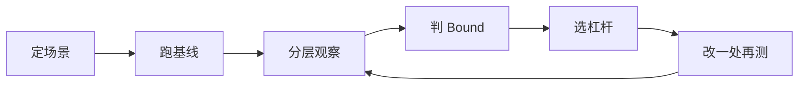

# 推理框架系统分析（个人学习）

目标：拿到一个新模型，能按固定顺序观察、定位瓶颈、说出优化方向。

这不是 Agent 调优平台笔记，而是给自己一套能讲清楚的分析框架。仓库里相关材料：

- [推理框架负载均衡路由器](../reasoning-lb-router-design.md)
- [llm-d：EPP 预测调度 Scorer 与 Coordinator](../llm-d-epp-predicted-scorer-and-coordinator.md)
- [Mooncake 功能学习计划](../mooncake-learning-plan/README.md)

---

## 拿到新模型时怎么走

1. **定场景**：负载长什么样、SLO 是吞吐还是时延、硬件和并行怎么切。
2. **跑基线**：Throughput、TTFT、TPOT、显存、NPU 利用率，先有对照数字。
3. **分层观察**：框架调度 → Runtime / 数据通路 → 算子 Kernel → 硬件利用率。
4. **判 Bound**：Compute / Memory / Scheduling / Communication / Framework。
5. **选杠杆**：先参数，再框架路径，再融合和 Kernel；一次只改一类。
6. **改一处再测**：对比基线，无效就回退，记下「为什么无效」。

---

## 文档

| 部分 | 文档 | 要能说清什么 |
|------|------|----------------|
| 为什么系统看 | [process/01-problem.md](process/01-problem.md) | 瓶颈不在一个 Kernel，变量互相咬 |
| 新模型观察清单 | [process/02-observe.md](process/02-observe.md) | 模型、硬件、负载、并行，先问哪几个问题 |
| 请求路径 | [process/03-request-path.md](process/03-request-path.md) | 请求从进到出经过哪些阶段、每段看什么指标 |
| Bound 诊断 | [process/04-diagnose.md](process/04-diagnose.md) | 四层 Profiling 怎么对上五种 Bound |
| 优化杠杆 | [process/05-levers.md](process/05-levers.md) | 参数、框架、融合、并行各动什么 |
| 口头讲稿 | [process/06-speak.md](process/06-speak.md) | 五分钟把分析顺序讲完 |
| 融合算子（杠杆展开） | [fusion/README.md](fusion/README.md) | 何时融、13 种模式、怎么接到 vllm-ascend、怎么用 msprof 验收 |

---

## 分析一句话

先用业务负载拿到基线，再按框架 / 调度 / 数据通路 / 算子往下看，用 Bound 类型决定动参数、改执行路径，还是融 Kernel；每次只验证一个假设。
