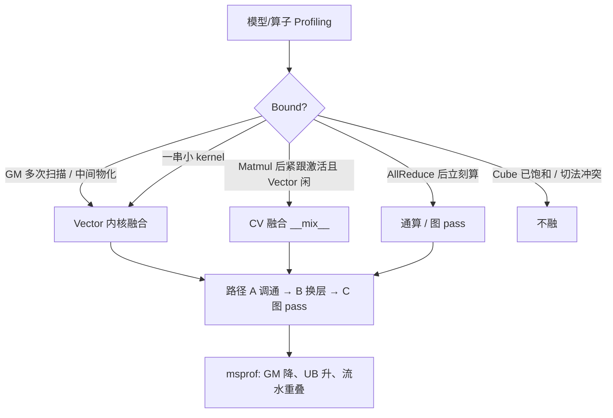

# 融合算子：总览与何时动手

这是「优化杠杆」里**图和 Kernel** 的展开，不是另一套分析顺序。仍先判 Bound，再决定融不融、融哪一层。

七段工作流：识别机会 → 设计数据流/tiling → 选 SIMD/CV/SIMT → 写 kernel → 跨架构 → 接到 vllm-ascend → msprof 再迭代。

---

## 三层融合（先能分开说）

| 层 | 做什么 | 典型 |
|----|--------|------|
| 内核 | 多个算子合成一个 AI Core kernel | Residual+RMSNorm；Matmul+激活（CV） |
| 图 | FX 上 pattern match，换成融合 op | RMSNorm+Quant；AllReduce+RMSNorm |
| 通算 | HCCL 与 Matmul 重叠（MC²） | AllGather+Matmul；走高层 API，不是 `__mix__` kernel |

内核里再分：

- **Vector**：连续 elementwise，中间量留 UB  
- **CV**（`__mix__(1,2)`，解耦架构）：Cube → L0C → UB → Vector，少一次 GM 往返  

**不要融**：Cube 已饱和；融合让 tiling 更难却没有访存收益；两段需要不同并行切法。

---

## 文档

| 部分 | 要能说清什么 |
|------|----------------|
| [01-patterns.md](01-patterns.md) | 13 种模式对上哪种 Bound、vllm-ascend 里叫什么 |
| [02-implement.md](02-implement.md) | 编程模型、片上层次、tiling 硬约束 |
| [03-integrate.md](03-integrate.md) | 路径 A/B/C、既有 pass 门控、新增 10 步 |
| [04-profile-arch.md](04-profile-arch.md) | 用哪些 csv 证明融成功；2201→3510 换了什么通路 |
| [05-speak.md](05-speak.md) | 五分钟讲「新模型要不要做融合」 |

回到上层分析：[优化杠杆](../process/05-levers.md)。
