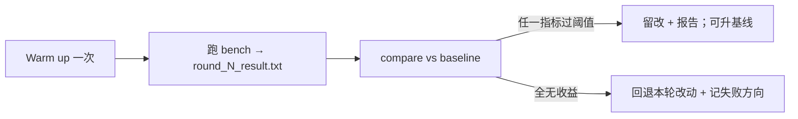

# Benchmark 出数与收益判定

日志分析的**数据入口**：bench 写出 `tune_reports/`，compare 对照基线，决定留改还是回退。不负责融 Kernel；只保证「同一负载、先热再测、数字可解析」。



---

## 怎么跑（vllm-benchmark）

1. 部署成功后必须 **warm up**：让 Prefill / Decode / RouteServer 都被打到，避免冷启动污染 TTFT。命令成功即可，不存结果；后续轮次复用，不要每轮重问。  
2. 执行用户给的测试命令，stdout/stderr 整段留下。  
3. 存 `tune_reports/round_{N}_result.txt`；N=0 再拷一份 `tune_reports/baseline.txt`。  
4. 口头摘要：吞吐、TTFT、TPOT 即可。

没有 warm up 命令就停，不要直接压测。

---

## 脚本认哪些行

`compare_benchmark.py` 用正则从 **vLLM benchmark 英文报表** 抠数。字段对不上（中文 bench、只印 QPS 别名）会解析成空，对比无意义。

| 文本里长这样 | key | 收益方向 |
|--------------|-----|----------|
| `Request throughput: X req/s` | `request_throughput` | 升 |
| `Output throughput: X tokens/s` | `output_throughput` | 升 |
| `Mean TTFT (ms): X` | `ttft_mean_ms` | 降 |
| `P99 TTFT (ms): X` | `ttft_p99_ms` | 降 |
| `Mean TPOT (ms): X` | `tpot_mean_ms` | 降 |
| `Mean e2e latency (ms): X` | `e2e_mean_ms` | 降 |

规则（默认阈值 5%，`--threshold 0.03` 可改）：

- key 含 `throughput`：变化率 **> +阈值** 算该项有收益  
- 其余当 latency：变化率 **< −阈值** 算该项有收益  
- 基线为 0 的 key 跳过  
- **`has_improvement` = 任一项 `improved`**；退出码 0 有收益、1 无收益  

开口时要补一句：脚本是 **OR 不是 AND**。TTFT 掉 40%、QPS 掉 2%，仍会判有收益。时延优先的轮次这是对的；吞吐优先时不要被退出码 0 骗过，要自己看 comparison 表。

---

## 对比之后做什么（vllm-compare）

```bash
python compare_benchmark.py tune_reports/baseline.txt tune_reports/round_{N}_result.txt
python compare_benchmark.py ... --threshold 0.03
```

- **有收益**：记下本轮改了哪些文件；生成 `tune_reports/round_{N}_report.md`；问要不要把当前结果升成新基线。  
- **无收益**：回退本轮代码（`checkout` / `stash`），报告里写清失败方向，下一轮别重复同一假设。

和日志分析的衔接：本轮报告里的「还差的指标」就是下一轮的调优方向（例如 TTFT 好了、TPOT 没动 → 下一轮不要再拧 Host 下载）。

下一篇可回到 [日志关键字](01-metrics-keywords.md) 选方向，或 [口头讲稿](04-speak.md)。
