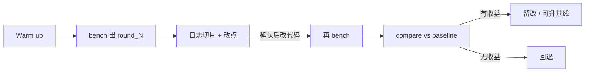

# vLLM 日志分析（与融合算子分开）

这是**框架 / Host 路径**上的观察手册：读部署日志、引擎日志、benchmark、profiling 文本，把现象对上 Scheduler、KV、排队、预处理，再决定改哪段代码。

不是 `fusion/` 那套：这里不写 Ascend C、tiling、图 pass。Decode 气泡若最后证明是小 Kernel / GM 往返，再转到融合笔记。

接到总流程的哪一步：跑基线、改一处再测——用同一套 `tune_reports/` 数字说话。判 Bound 仍用日志关键字；**不要**把 compare 退出码当成 Bound 结论。

纪律：先结论和改点，**确认后再动代码**。默认阈值约 5%；脚本是「任一指标过线即有收益」，和「主指标必须过线」不是一回事。

---

## 文档

| 部分 | 要能说清什么 |
|------|----------------|
| [01-metrics-keywords.md](01-metrics-keywords.md) | 指标含义；方向 → 日志关键字 |
| [02-code-map.md](02-code-map.md) | 现象落到 vLLM 哪些文件 |
| [03-case-preprocess.md](03-case-preprocess.md) | 多模态 Host 预处理（已脱敏） |
| [04-speak.md](04-speak.md) | 口头：从日志讲到改点 |
| [05-benchmark-compare.md](05-benchmark-compare.md) | warm up、结果文件、compare 解析字段与 OR 判定 |

回到 [系统分析](../README.md)。融合验收仍走 [fusion/](../fusion/README.md)。
