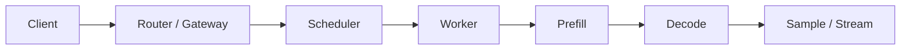

# 请求路径：从进到出每一跳看什么

系统分析的骨架是请求路径。说不清路径，就说不清瓶颈在哪一层。

混合模式通常 1 次选路；PD 分离是 Prefill 选路 + Decode 选路，中间多 KV 传输。细节对照 [推理框架负载均衡路由器](../../reasoning-lb-router-design.md)。

---

## 按阶段看

| 阶段 | 在干什么 | 异常时长往往意味着 |
|------|----------|--------------------|
| 收包与解析 | HTTP / OpenAI schema、tokenize | 协议、tokenizer、Host CPU |
| 多模态预处理（若有） | 图像/视频进视觉编码器 | 视觉算子、Host–Device 拷贝；**下图/解码排队会直接打高 TTFT**，见 [日志分析](../log-analyze/README.md) |
| 排队与调度 | 入队、组 batch、选 Worker | 队列堆积、batch 组不满、长短请求互堵 |
| Prefill | 整段 prompt 一次前向 | 计算或显存带宽；TTFT 主因之一 |
| 采样与首 token | logits → token | 采样实现、同步等待 |
| Decode | 逐步生成、KV 追加 | TPOT；KV 带宽、小 Shape Kernel |
| KV 传输（PD 时） | P → D | 传输引擎、拓扑、无法 overlap |

仪表盘不够时，至少把 **排队时间、Prefill、Decode、通信** 拆开。TTFT 高不一定是计算慢，可能是队列或调度。

---

## 框架层先看这几个数

还没下到算子时，先看 Serving 是否健康：

- Request Queue 延迟、队列长度
- Prefill / Decode 时间占比、是否互相抢
- Continuous Batching 是否真的在填 Decode 气泡
- Prefix Cache / KV 命中率
- `max_num_seqs`、`max_num_batched_tokens` 是否把 batch 卡死或把显存打爆
- PD 时 `queue_P` / `queue_D` 是否一边饿、一边堵

这些坏了，先别钻 Kernel。

---

## 和硬件对一下

路径走通之后，用资源数交叉验证「慢在等还是慢在算」：

- 计算单元利用率（Cube / Tensor Core 等）
- 显存占用与是否碎片、OOM
- 显存带宽是否打满
- 集合通信耗时是否露在关键路径

下一篇：[Bound 诊断](04-diagnose.md)。
