# 推理框架负载均衡路由器

> PPT 素材：Mermaid + 图下要点

---

## 1. 两种模式

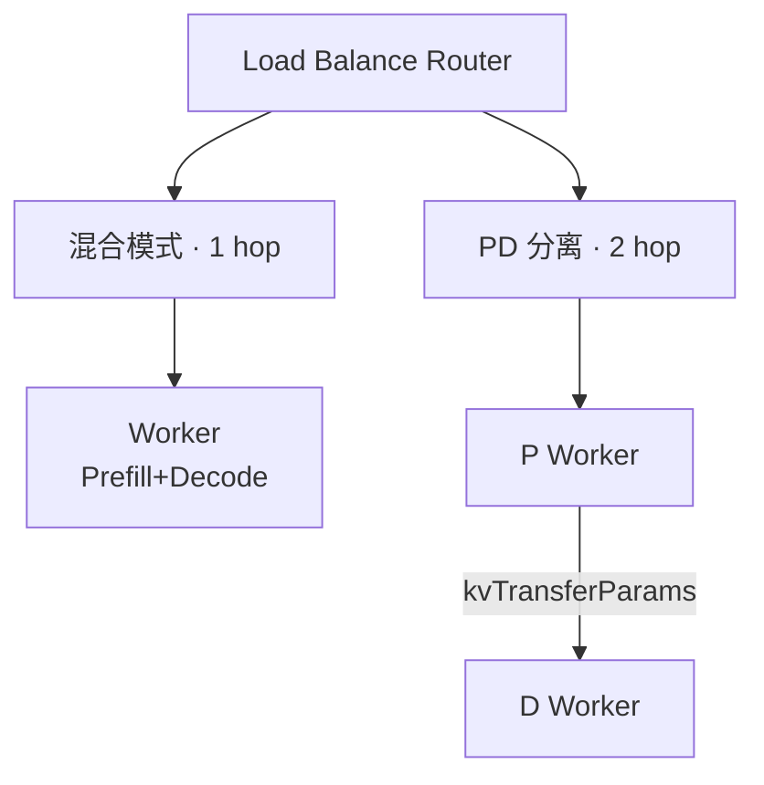

| | 混合 | PD 分离 |
|---|---|---|
| Worker | 同质 | P + D |
| 路由 | 1 次 | P 选路 + D 选路 |
| KV 跨节点 | 否 | 是 |
| 队列 | `queue` | `queue_P` + `queue_D` |

---

## 2. 请求输入（必填）

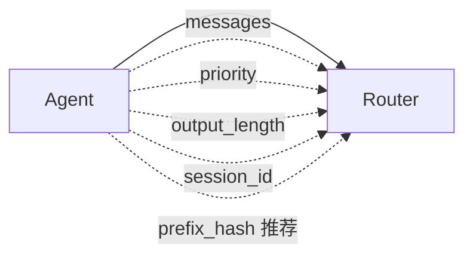

| 字段 | 用途 |
|---|---|
| `priority` | WSPT 排序；入队处理一次 → 透传 vLLM/SGLang |
| `output_length` | osl；WSPT cost；透传后端 |
| `session_id` | 多轮 / affinity |
| `prefix_hash` | 渐变选 Worker；kv_preset |

```json
{
  "messages": [...],
  "metadata": {
    "orla": {
      "session_id": "run-42",
      "priority": 5,
      "output_length": 1024,
      "cache": { "prefix_hash": "sha256:abc" }
    }
  }
}
```

- 缺 `priority` / `output_length` / `session_id` → **400**

---

## 3. Router 状态表

| 表 | 内容 | 更新 |
|---|---|---|
| `in_flight` | `worker_id → count` | 到达 +1，离开 -1 |
| `kv_preset` | Worker 上 PrefixHash 快照 | Prefill/Decode 完成 Upsert |

```text
L = Σ in_flight[w]    // 总在途，上限 32
```

---

## 4. 优先级队列 + WSPT

### 准入

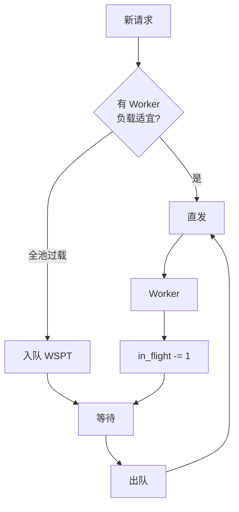

| 路径 | 条件 |
|---|---|
| 直发 | ∃ Worker：`in_flight ≤ T_low` |
| 入队 | ∀ Worker：`in_flight > T_low` |
| 出队 | 某 Worker 回落 → WSPT pop |

### WSPT

```text
wspt_key = (1 + priority) / f(isl_tokens, output_length)
```

- 出队结合 **最低 load Worker** + **WSPT 序**
- `priority` 入队读一次；dispatch 透传后端（vLLM 需极性转换）

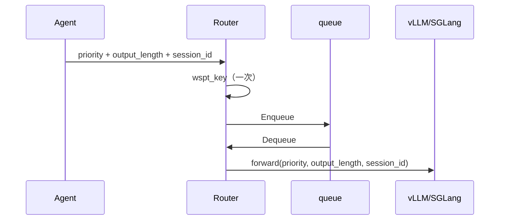

### Priority 透传

| 层 | 职责 |
|---|---|
| Router | 准入 + WSPT |
| vLLM / SGLang | 引擎排队 + KV eviction |

- PD：P、D 各透传一次，D 不重算 WSPT
- 后端需开启 priority-aware 调度

### 队列拆分

| 模式 | 队列 |
|---|---|
| 混合 | `queue` |
| PD | `queue_P`（Prefill 前）· `queue_D`（Decode 前） |

---

## 5. 渐变选 Worker

```text
w_prefix(L) = 1 - L/32
w_load(L)   = L/32

score(w) = w_prefix × hash_hit(w, H) + w_load × load_norm(w)
hash_hit = kv_preset.Has(w, prefix_hash)
```

| L | 倾向 |
|---|---|
| 0~16 | 优先 PrefixHash；无命中 → 最低 load |
| 17~32 | load 权重上升，少选 Hash 热点 |

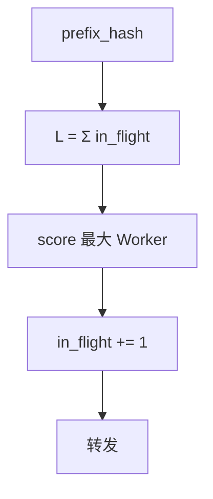

- 队列决定 **何时**；渐变决定 **发给谁**
- 出队用最新 in_flight / kv_preset

---

## 6. 混合模式

### 架构

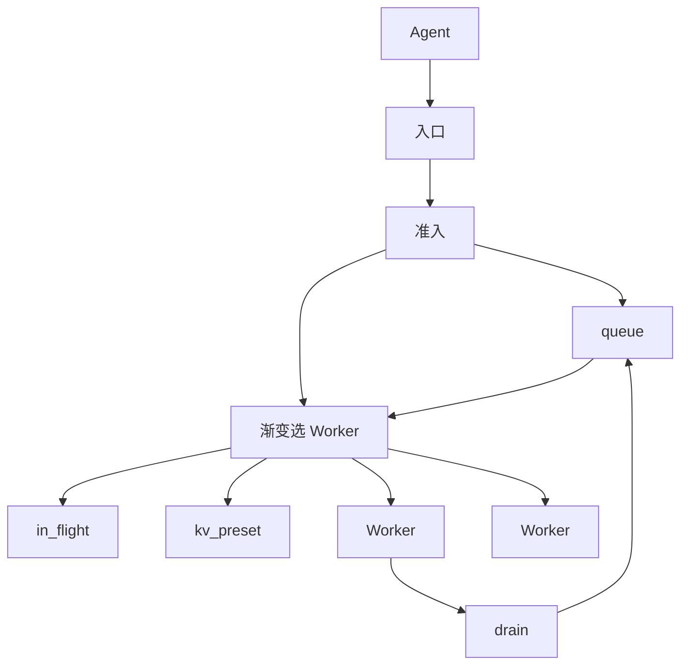

### Process Map

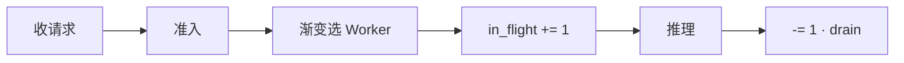

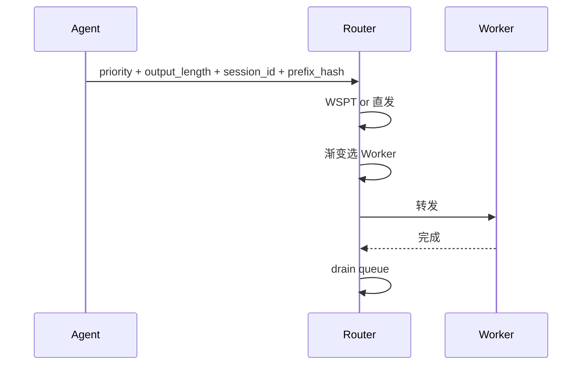

### Data Flow

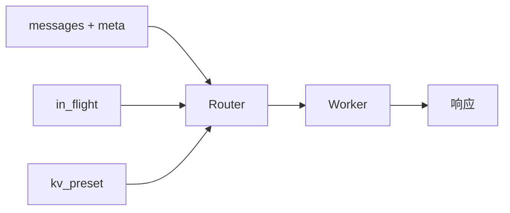

---

## 7. PD 分离模式

### 架构

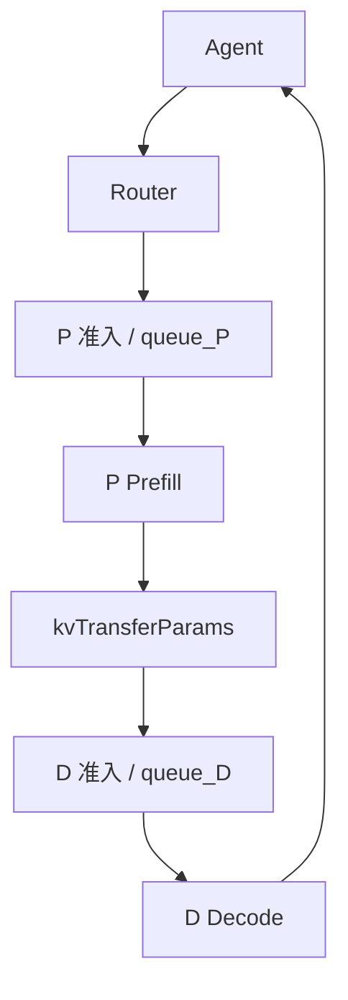

### Process Map


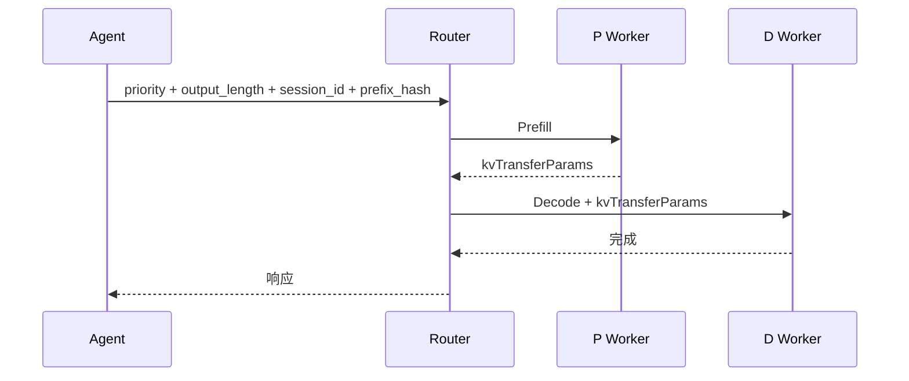

### P 选路

- 公式同 §5，`L` 仅统计 **P 池**
- `in_flight_P`：进 P +1，Prefill 完成 -1
- `kv_preset_P`：P 侧 PrefixHash

### kvTransferParams

| 字段 | 说明 |
|---|---|
| `source_p_worker` | 来源 P |
| `kv_block_handles` | KV 传输句柄 |
| `prefix_hash` | 可选 |
| `token_count` | Prefill tokens |

### D 选路（接口预留）

```text
SelectDWorker(prefix_hash, kvTransferParams, in_flight_D, kv_preset_D) → d_id
// TODO: PrefixHash Decode + load 惩罚渐变（结构同 P 池）
// v0 fallback: argmin in_flight_D
```

| 表 | 更新 |
|---|---|
| `in_flight_D` | 进 D +1，Decode 完成 -1 |
| `kv_preset_D` | D 侧 PrefixHash（预留） |

### Data Flow

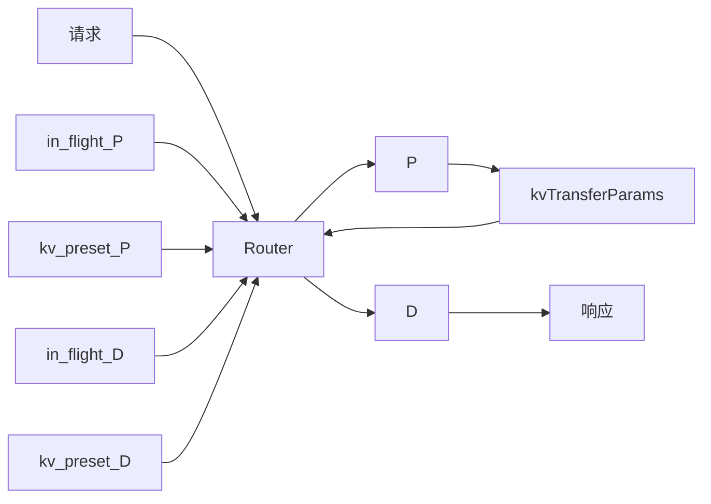

---

## 8. 接口汇总

```text
// 准入 / 队列
ShouldBypassQueue(pool) → bool
Enqueue(pool, req) / DequeueWSPT(pool) → req
OnWorkerIdle(w, pool)

// 选路
SelectWorker(H, in_flight, kv_preset) → worker_id      // 混合 / P
SelectDWorker(H, kvTransferParams, …) → d_id           // D · TODO

// 状态
in_flight[worker] += 1 / -= 1
HasPreset(worker, prefix_hash) / UpsertPreset(...)

// 透传
NormalizeIngress(req) → {priority, output_length, session_id}
MapEnginePriority(backend, priority)
AttachToForward(req, …)
```

---

## 9. 对照

| | 混合 | P 池 | D 池 |
|---|---|---|---|
| 渐变选路 | ✓ | ✓ | 预留 |
| WSPT 队列 | `queue` | `queue_P` | `queue_D` |
| kv_preset | ✓ | ✓ | 预留 |
| priority 透传 | 引擎 | P 引擎 | D 引擎 |
