# 推理框架负载均衡路由器

> PPT 素材：Mermaid + 图下要点

---

## 1. 两种模式

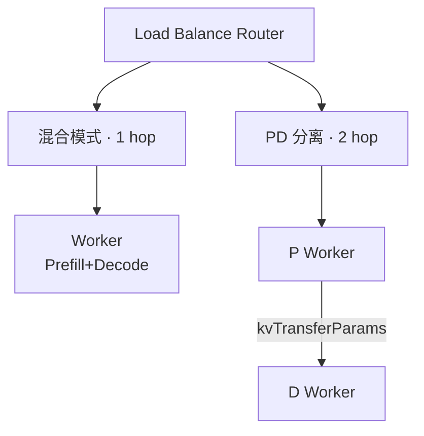

| | 混合 | PD 分离 |
|---|---|---|
| Worker | 同质 | P + D |
| 路由 | 1 次 | P 选路 + D 选路 |
| KV 跨节点 | 否 | 是 |
| 队列 | `queue` | `queue_P` + `queue_D` |

---

## 2. 接口设计

三类 JSON 接口：Request Input → Worker Status → Route Result。

### 2.1 Request Input

Agent 发往 Router 的请求扩展。对齐 Dynamo `nvext.agent_hints`：必填 `priority`、`session_id`、`output_length`。

**不传 `prefix_hash`**：prefix / KV 命中由 Router 内部闭环（Worker Status 回写 `kv_preset`，按 `session_id` 关联）。

```json
{
  "request_id": "req-1001",
  "model": "qwen3-80b",
  "messages": [
    { "role": "user", "content": "..." }
  ],
  "priority": 5,
  "session_id": "run-42",
  "output_length": 1024,
  "mode": "mixed"
}
```

**字段说明**

- `request_id`：请求唯一 ID；可省略，由 Router 生成。
- `priority`：调度优先级，数值越大越优先；入队时用于 WSPT，并透传 vLLM/SGLang。
- `session_id`：Agent 会话 ID，用于多轮关联与 session-aware 调度。
- `output_length`：预估输出 token 数（Dynamo 中的 `osl`），用于 cost 估算与负载预测。
- `mode`：`mixed` 或 `pd`；可省略，跟随集群配置。

Dynamo 风格等价写法：

```json
{
  "model": "qwen3-80b",
  "messages": [{ "role": "user", "content": "..." }],
  "nvext": {
    "agent_hints": {
      "priority": 5,
      "osl": 1024
    },
    "agent_context": {
      "session_id": "run-42"
    }
  }
}
```

缺 `priority` / `session_id` / `output_length` 返回 400。`osl` 与 `output_length` 同义。

### 2.2 Worker Status

Worker 向 Router 上报的状态，或 `GET /workers` 查询结果。Router 据此做 load-aware / kv-aware 决策。

```json
{
  "worker_id": "worker-3",
  "role": "mixed",
  "in_flight": 2,
  "kv_cache": {
    "used_tokens": 12000,
    "total_tokens": 32000,
    "usage": 0.375,
    "prefix_hashes": ["sha256:abc", "sha256:def"]
  },
  "available": true,
  "healthy": true,
  "updated_at": "2026-07-09T07:00:00Z"
}
```

**字段说明**

- `worker_id`：Worker 唯一标识。
- `role`：`mixed` / `prefill` / `decode`，区分混合与 PD 角色。
- `in_flight`：当前承载的请求数；到达 +1，离开 -1。
- `kv_cache.used_tokens`：KVCache 已占用 token 数。
- `kv_cache.total_tokens`：KVCache 总容量。
- `kv_cache.usage`：使用率，`used / total`，范围 0~1。
- `kv_cache.prefix_hashes`：Worker 上报的缓存前缀；Router 内部维护，请求侧不传。
- `available`：是否可被调度；`false` 时不参与选路。
- `healthy`：健康状态；`false` 时不参与选路。
- `updated_at`：状态更新时间。

列表接口：

```json
{
  "workers": [
    {
      "worker_id": "worker-1",
      "role": "mixed",
      "in_flight": 0,
      "kv_cache": {
        "used_tokens": 0,
        "total_tokens": 32000,
        "usage": 0.0,
        "prefix_hashes": []
      },
      "available": true,
      "healthy": true,
      "updated_at": "2026-07-09T07:00:00Z"
    }
  ]
}
```

### 2.3 Route Result

Router 完成选路后的结果，可挂在响应扩展或内部事件中。

```json
{
  "request_id": "req-1001",
  "target_worker": "worker-3",
  "score": 0.86,
  "score_detail": {
    "kv": 1.0,
    "load": 0.72
  },
  "routing_reason": "kv_hit",
  "queued": false,
  "mode": "mixed"
}
```

**字段说明**

- `request_id`：对应请求 ID。
- `target_worker`：最终选中的 Worker。
- `score`：算法对目标 Worker 的综合得分，越高越优。
- `score_detail.kv`：KV-aware 分项（前缀命中等）。
- `score_detail.load`：Load-aware 分项（in_flight / 负载）。
- `routing_reason`：选路原因，如 `kv_hit`、`least_load`、`waiting`、`fallback`。
- `queued`：是否曾进入 Waiting List。
- `mode`：实际路由模式，`mixed` 或 `pd`。

PD 模式结果：

```json
{
  "request_id": "req-1002",
  "mode": "pd",
  "prefill_worker": "p-1",
  "decode_worker": "d-2",
  "target_worker": "d-2",
  "score": 0.79,
  "score_detail": {
    "kv": 0.9,
    "load": 0.68
  },
  "routing_reason": "kv_hit",
  "queued": true
}
```

- `prefill_worker`：PD 下 Prefill 节点。
- `decode_worker`：PD 下 Decode 节点；`target_worker` 通常等于 `decode_worker`。

---

## 3. Router 状态表

| 表 | 内容 | 更新 |
|---|---|---|
| `in_flight` | `worker_id → count` | 到达 +1，离开 -1 |
| `kv_preset` | Worker 上 PrefixHash 快照 | Prefill/Decode 完成 Upsert |
| `worker_status` | §2.2 全量状态 | heartbeat / metrics |

```text
L = Σ in_flight[w]    // 总在途，上限 32
```

---

## 4. 优先级队列 + WSPT

### 准入

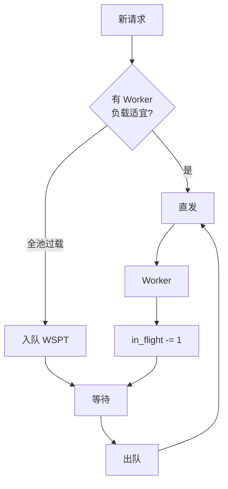

| 路径 | 条件 |
|---|---|
| 直发 | ∃ Worker：`in_flight ≤ T_low` |
| 入队 | ∀ Worker：`in_flight > T_low` |
| 出队 | 某 Worker 回落 → WSPT pop |

### WSPT

```text
wspt_key = (1 + priority) / f(isl_tokens, output_length)
```

- 出队结合 **最低 load Worker** + **WSPT 序**
- `priority` 入队读一次；dispatch 透传后端（vLLM 需极性转换）

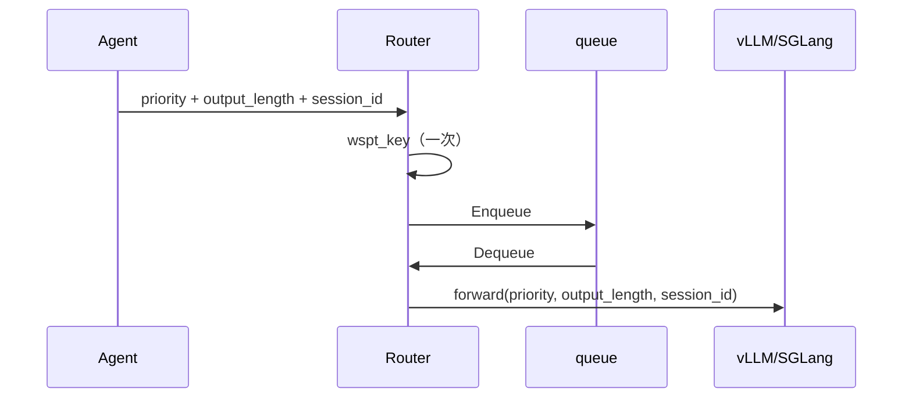

### Priority 透传

| 层 | 职责 |
|---|---|
| Router | 准入 + WSPT |
| vLLM / SGLang | 引擎排队 + KV eviction |

- PD：P、D 各透传一次，D 不重算 WSPT
- 后端需开启 priority-aware 调度

### 队列拆分

| 模式 | 队列 |
|---|---|
| 混合 | `queue` |
| PD | `queue_P`（Prefill 前）· `queue_D`（Decode 前） |

---

## 5. 渐变选 Worker

```text
w_prefix(L) = 1 - L/32
w_load(L)   = L/32

// H 由 Router 内部闭环：session_id → kv_preset（Worker 上报），请求不传 prefix
score(w) = w_prefix × hash_hit(w, session_id) + w_load × load_norm(w)
hash_hit = kv_preset.HasSession(w, session_id)
```

| L | 倾向 |
|---|---|
| 0~16 | 优先 KV 命中；无命中 → 最低 load |
| 17~32 | load 权重上升，少选热点 |

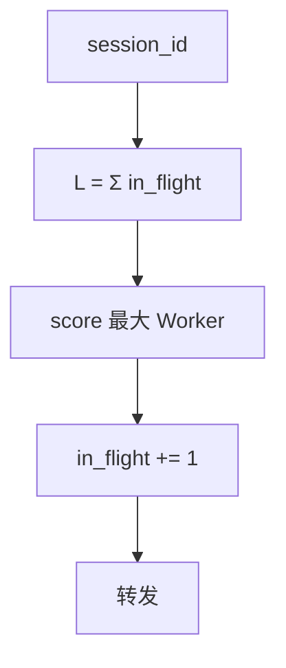

- 队列决定 **何时**；渐变决定 **发给谁**
- prefix / KV 状态仅来自 Worker Status 回写，请求侧闭环外不可见

---

## 6. 混合模式

### 架构

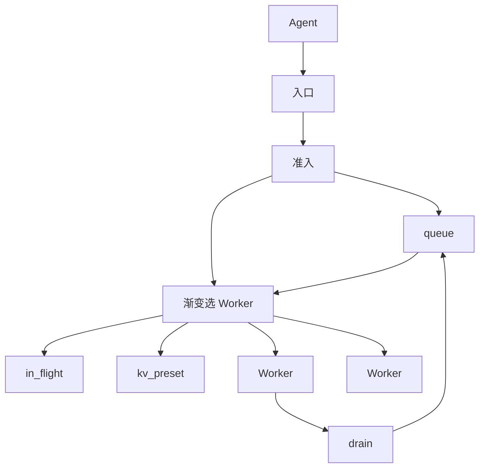

### Process Map

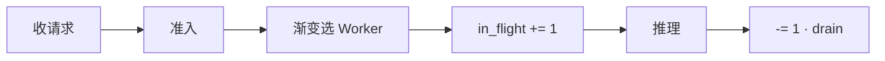

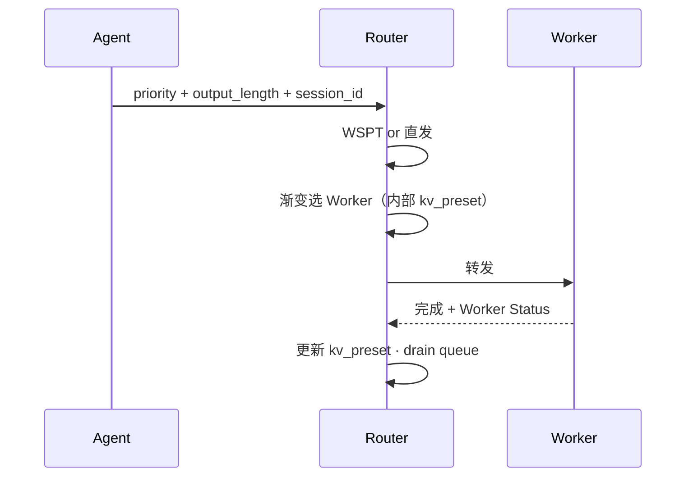

### Data Flow

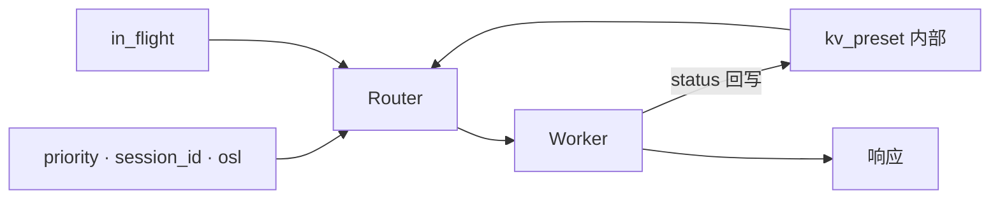

---

## 7. PD 分离模式

### 架构

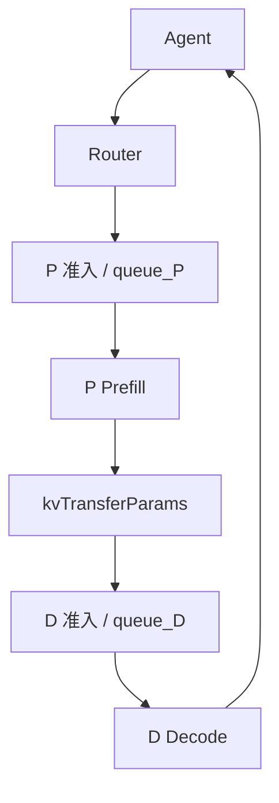

### Process Map

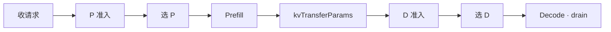

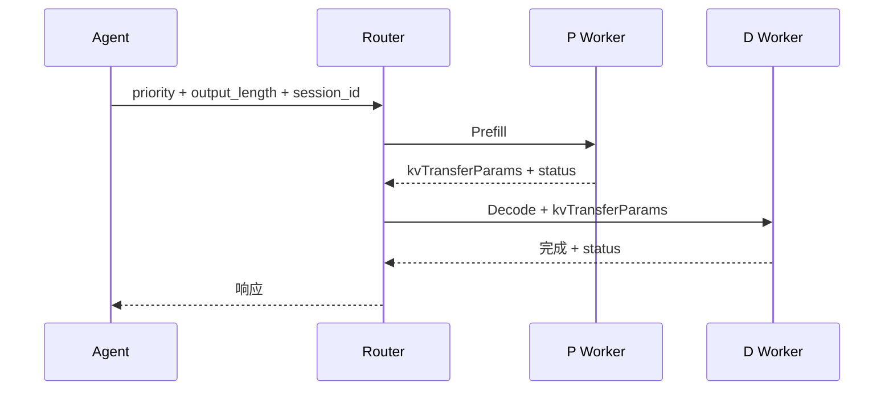

### P 选路

- 公式同 §5，`L` 仅统计 **P 池**
- `in_flight_P`：进 P +1，Prefill 完成 -1
- `kv_preset_P`：P 侧 KV 状态（Worker 回写，请求不传）

### kvTransferParams

| 字段 | 说明 |
|---|---|
| `source_p_worker` | 来源 P |
| `kv_block_handles` | KV 传输句柄 |
| `token_count` | Prefill tokens |

### D 选路（接口预留）

```text
SelectDWorker(session_id, kvTransferParams, in_flight_D, kv_preset_D) → d_id
// TODO: KV Decode + load 惩罚渐变（结构同 P 池）
// v0 fallback: argmin in_flight_D
```

| 表 | 更新 |
|---|---|
| `in_flight_D` | 进 D +1，Decode 完成 -1 |
| `kv_preset_D` | D 侧 KV 状态（Worker 回写，预留） |

### Data Flow

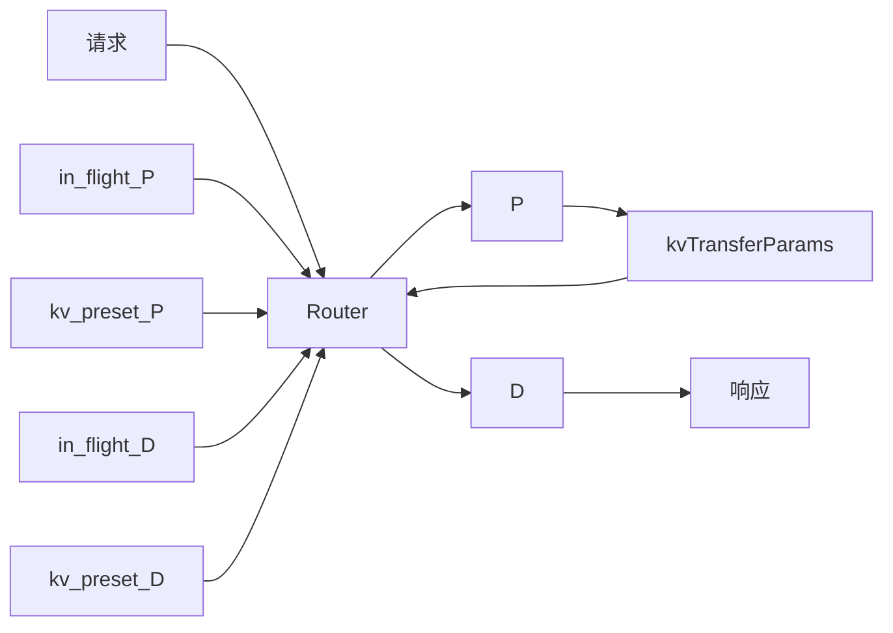

---

## 8. 接口汇总

```text
// Request Input（无 prefix_hash）
ParseRequest(req) → {request_id, priority, session_id, output_length}

// Worker Status → Router 内部闭环维护 kv_preset
ListWorkers() / GetWorker(id) / Heartbeat(status)
in_flight[worker] += 1 / -= 1
HasSession(worker, session_id) / UpsertPreset(...)

// Route Result
SelectWorker(session_id, in_flight, kv_preset) → RouteResult
SelectDWorker(...) → RouteResult   // PD · TODO

// Queue
ShouldBypassQueue(pool) → bool
Enqueue(pool, req) / DequeueWSPT(pool) → req
```

---

## 9. 对照

| | 混合 | P 池 | D 池 |
|---|---|---|---|
| 渐变选路 | ✓ | ✓ | 预留 |
| WSPT 队列 | `queue` | `queue_P` | `queue_D` |
| kv_preset | ✓ | ✓ | 预留 |
| priority 透传 | 引擎 | P 引擎 | D 引擎 |
